# Platform Architecture

This repository is an nine-system, AI-driven Finance & Tax automation platform — four deterministic
calculation engines, a read-only validation engine, the Knowledge Brain retrieval engine, an
interactive finance operations atlas, and the Triangulate AI control framework — with an optional
orchestration layer:

1. seeded fictional data generators
2. calculation engines
3. evidence artifacts
4. independent validation
5. self-healing loops — engines detect drift, re-derive it from source, and re-verify, escalating
   only what they cannot certify
6. executive-ready reporting and gated verdicts
7. an optional orchestration layer that coordinates longer-running work through the same controls

The design principle is straightforward: the system that produces a number should not be the only
system permitted to approve that number.

---

## Big picture: core finance platform

---

## Stage by stage

### 1. Command entry

The same workflow can start from a Python command, continuous integration, or — in approved,
agent-enabled environments — the optional orchestration layer. The entry point is flexible; the
control trail stays the same.

### 2. Seeded fictional data

Each engine ships with a generator that creates fake but realistic finance data. Fixed seeds make
the output reproducible.

### 3. Calculation engines

| Engine | Folder | What it computes |
|---|---|---|
| Close Engine | `monthly-close-automation` | recurring journal entries, intercompany balancing, close evidence |
| Reconciliation Engine | `cash-reconciliation` | GL-to-bank/lender matching with materiality classification |
| Surplus / ACB Model | `tax-surplus-engine` | foreign-affiliate surplus pools, distribution waterfall, ACB ledger |
| Partnership 1065 Automation | `partnership-1065-automation` | source intake, book-to-tax bridge, 1065 line mapping, K-1 preview, IRC §704(c) built-in gain |

### 3a. Knowledge / retrieval engine

Not every engine computes a number. The Knowledge Brain is a retrieval engine: it ingests
timestamped meeting transcripts into a citation-governed knowledge base and serves them back as
verbatim, sourced citations.

| Engine | Folder | What it serves |
|---|---|---|
| Knowledge Brain | `knowledge-brain-engine` | meeting transcripts -> a citation-governed knowledge base: verbatim, timestamped citations for workpapers and meeting prep; a review -> remediation mode that turns a reviewer's recorded corrections into cited directives plus an apply-ready remediation prompt (applied downstream by an AI or operator, not the engine); refuses when no source clears its relevance floor |

### 4. Evidence artifacts

The engines emit Markdown, JSON, and optional `.xlsx` workbooks. These artifacts are the handoff
between "producer" systems and "checker" systems.

### 5. Independent validation

The validation layer does not trust the output just because the output exists.

- **Validation Engine:** read-only rules over workbook and JSON artifacts.
- **Triangulate Orchestrator:** AI separation of duties (preparer / reviewer / specialist) plus a deterministic audit gate and human sign-off.

### 5a. Self-healing loops

Detection alone still leaves a person working the exception list. The loop layer closes that gap:

**observe → detect → remediate → re-verify → gate → repeat**

Each loop treats the engine's own control harness as its *sensor* and a deterministic
re-derivation from the seeded source of record as its *authority*. It finds the earliest scope
that fails a check, resyncs it to source (booking every change as an adjustment), and re-verifies —
until everything ties or a turn budget is exhausted. It never invents a number: the settled state
is byte-identical to a clean engine run.

| Loop | Package | Gate policy |
|---|---|---|
| Assurance Loop | `surplus_engine.loop` | human-gated: `PASS` / `FLAG` / `FAIL` — material adjustments stop for a person |
| Autonomous Close Loop | `close_engine.loop` | policy-gated: `AUTO-POSTED` / `PARTIAL` / `HALTED` — posts on its own authority, quarantines a tampered locked period, refuses a broken opening |

The two policies bracket the spectrum: the same loop architecture runs human-gated where sign-off
is required and autonomously where policy allows — the controls and the audit trail are identical.

### 6. Verdicts

The platform produces review-ready artifacts:

- PASS / REVIEW / FAIL verdicts
- fix packets
- QA summaries
- change logs
- machine-readable JSON

The human reviewer remains the final authority wherever the gate policy requires one — and every
autonomous action still traces to a deterministic control.

---

## Deployment architecture

The platform has two deployment tracks.

### Enterprise-safe track

This is the public demo mode.

It uses Python, Excel-compatible files, `openpyxl`, `pytest`, Markdown, JSON, and CI. It requires no
agent or orchestration dependency.

### Agent-enabled track

This is the advanced workflow for environments that permit AI orchestration.

An optional orchestration layer can coordinate longer-running work, handoffs, and background review
passes: dispatch a job, track status, receive exceptions, and approve the final communication, all
through the same controls. The final output is a report package plus an executive-ready email draft.
The orchestration layer does not replace deterministic validation or human sign-off.

## Executive package

After validation, the system can produce:

- executive summary
- findings and exceptions
- validation status
- files generated
- recommended next action
- CEO/CFO-ready email draft

Sending can be gated by human approval or by a client-approved routing policy.

---

## Design principles

- **Determinism first.** Seeded generators and exact arithmetic make reruns reproducible.
- **Separation of duties.** Builders do not get to bless their own work.
- **Read-only validation.** Checkers should not mutate the files they inspect.
- **Refuse, do not fudge.** Engines reject out-of-tie entries rather than plugging them — and the
  Knowledge Brain refuses to answer when no source clears its relevance floor.
- **Evidence by default.** Every run leaves a reviewable trail, and prior decisions stay citable:
  the Knowledge Brain turns meeting transcripts into verbatim, timestamped citations for workpapers.
- **Client-aware deployment.** The same control pattern runs with or without the optional
  orchestration layer, depending on the client's IT rules.
- **Executive-ready communication.** The output is not just technical artifacts; it is packaged so
  leadership can understand what happened and what needs a decision.

---

*Capability-level architecture demonstrated on fictional data, with confidential engagement detail withheld.*
