<p align="center">
  
</p>

# Sophon Finance Systems — AI-Driven Finance & Accounting Automation

[](https://github.com/sophonfinance-wq/finance-automation-portfolio/actions/workflows/ci.yml)
[](https://github.com/sophonfinance-wq/finance-automation-portfolio/actions/workflows/run-finance-engine.yml)
[](https://codespaces.new/sophonfinance-wq/finance-automation-portfolio)
[](./LICENSE)
[](https://www.python.org/)

**Finance, automated. Intelligence, applied.**

An AI-driven finance automation platform: seven runnable finance systems, AI review under
separation-of-duties controls, and executive-ready reporting. An optional orchestration layer can
coordinate longer-running work and route results through the same controls in approved,
agent-enabled environments; the platform runs fully without it.

This is a working portfolio: production-grade Python packages, seeded fictional data, deterministic
outputs, continuous integration, and 200,000+ tests that pin the behavior.

The premise is direct. Finance teams should not depend on manual spreadsheet work, scattered review
notes, or ad-hoc AI sessions. A request can run the finance engines, validate the results, package
the findings, and draft a clean executive email for the CEO or finance leadership. Work is
dispatched, status is tracked, and the final communication is approved before it is sent.

## What this demonstrates

This portfolio shows a disciplined pattern for applying AI to financial work:

1. Build the finance engine.
2. Generate traceable evidence.
3. Validate the output with read-only rules.
4. Challenge AI-assisted work through separation of duties.
5. Keep a human accountable for final sign-off.

That principle is the foundation of **Triangulate**, the AI validation framework in this repository:
no material financial deliverable should rest on a single model's output.

**Sophonnarith Hang** — AI Finance Engineer / AI Engineering Accountant · Founder, Sophon Finance Systems (18+ yrs senior accounting; GAAP/FAR/CAS)
**Email:** sophonfinance@gmail.com
**LinkedIn:** [linkedin.com/in/sophonnarith](https://www.linkedin.com/in/sophonnarith)

---

## See it run

**Try it yourself — three ways, all on fictional data:**

1. **Run it in your browser, no install** — [open this repo in a GitHub Codespace](https://codespaces.new/sophonfinance-wq/finance-automation-portfolio) (free tier; needs a GitHub account). When setup finishes, run `bash scripts/demo.sh` for the full tour, or a single engine, e.g.
   `cd knowledge-brain-engine && python -m brain_engine remediate "Surplus Workpaper Review — Reviewer Corrections"`.
2. **Run it on GitHub Actions** — **[Run Finance Engine Demo](https://github.com/sophonfinance-wq/finance-automation-portfolio/actions/workflows/run-finance-engine.yml)** → **Run workflow** → choose one engine or `all` → download the artifact from the completed run. *(GitHub only shows the **Run workflow** button to accounts with write access, so **fork** the repo first to run it on your own copy.)*
3. **Clone and run locally** — `pip install -r requirements.txt`, then `python -m pytest -q` (200,000+ tests) or `bash scripts/demo.sh`.

Every path runs only the fictional-data demos in this public repository.

Each GIF below shows a runnable engine producing evidence from fictional data, followed by the
animated flow chart that explains each step.

### Month-End Close Engine

<p>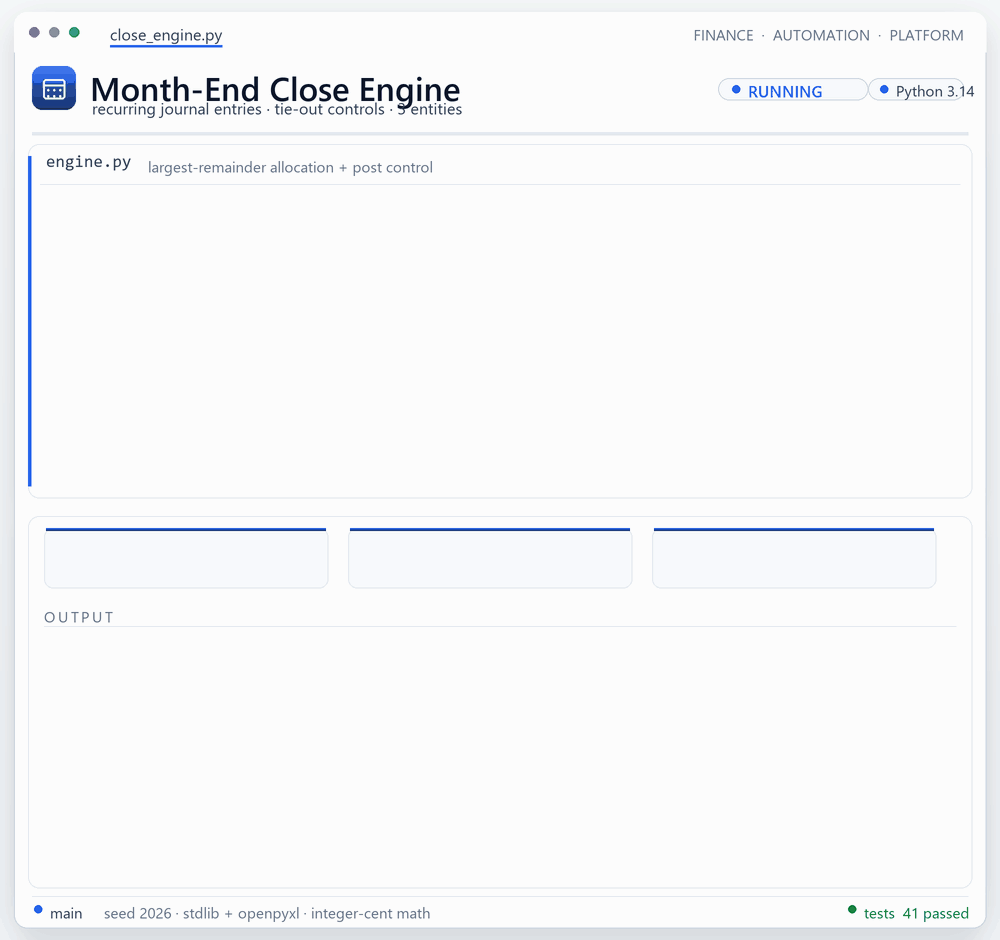</p>
<p align="center"></p>

### Cash and Debt Reconciliation

<p>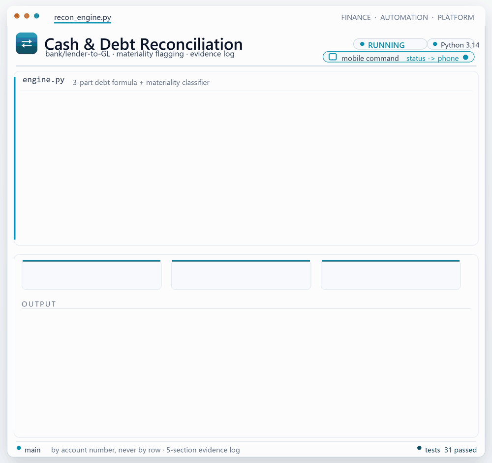</p>
<p align="center"></p>

### Tax Surplus and ACB Model

<p></p>
<p align="center"></p>

### Partnership 1065 Automation

<p>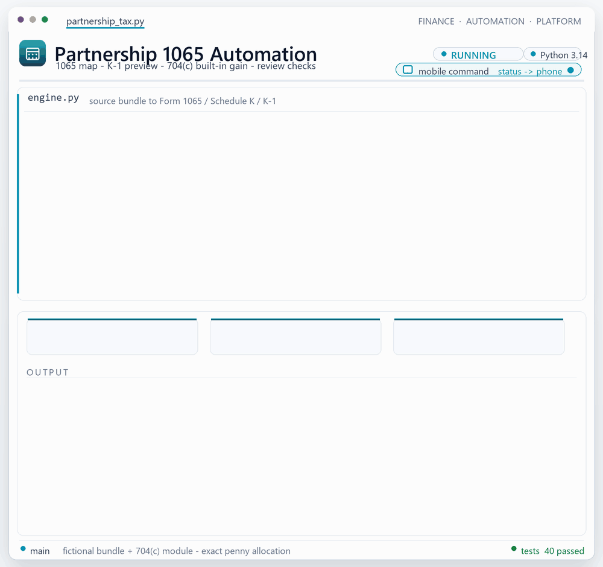</p>
<p align="center"></p>

### Validation Engine

<p>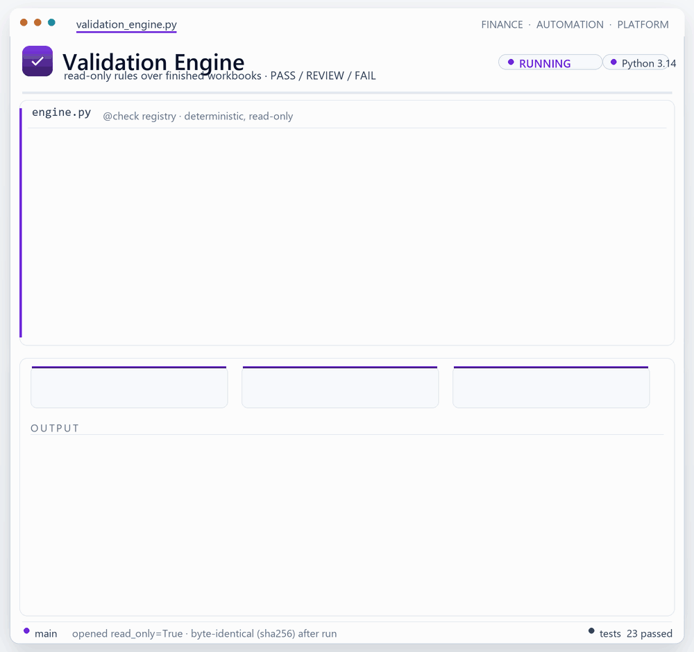</p>
<p align="center"></p>

### Triangulate AI Validation

<p>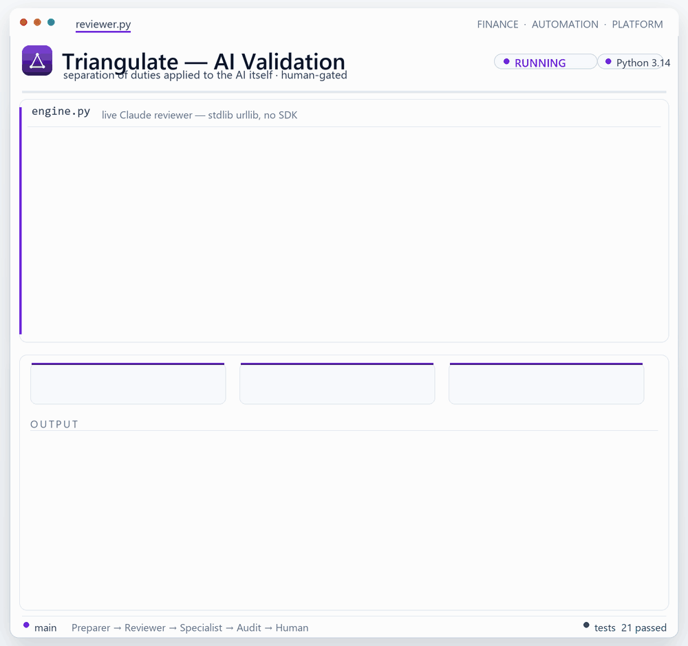</p>
<p align="center"></p>

### Knowledge Brain Engine

Meeting transcripts become a citation-governed knowledge base: prep for meetings and pull verbatim,
timestamped citations for workpapers and disclosure notes — and the brain refuses when it has no
source. It also runs **review → remediation**: a reviewer's recorded corrections become cited
change-directives and an **auto-generated, apply-ready remediation prompt** (plus a change-log
mapping each directive → source → status) — the transcript is the instruction set, and a downstream
AI or operator uses that prompt to apply the changes. See
**[Knowledge Brain Engine](./knowledge-brain-engine/)**.

<p>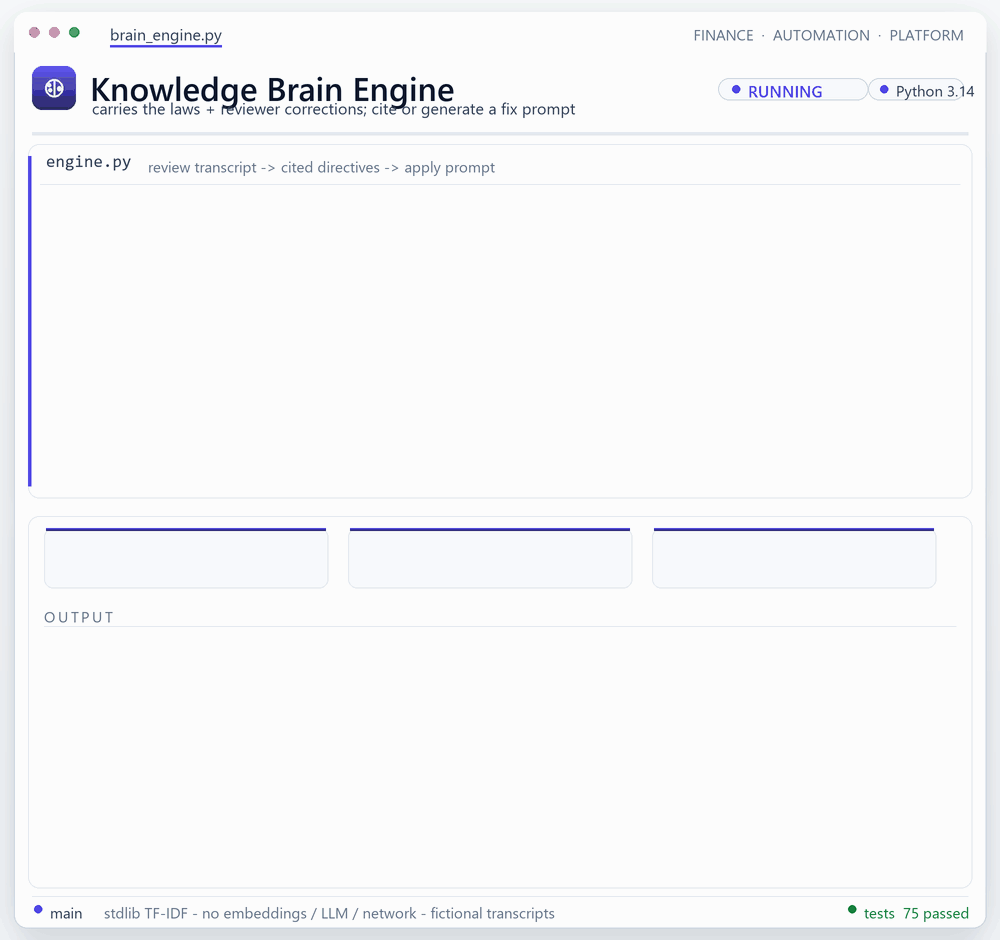</p>
<p align="center"></p>

All seven demos run on synthetic data. The **[Guided Demo & Walkthrough](./docs/DEMO-WALKTHROUGH.md)**
shows the command to run, what to inspect, and what each system proves.

---

## The operating model: from request to executive package

The platform can be deployed two ways.

### Optional orchestration layer

In approved, agent-enabled environments, an optional orchestration layer can sit above the seven
systems to coordinate longer-running work. It runs background review queues, manages multi-step
handoffs, and routes status updates back to the operator — all through the same controls. The
platform runs fully without this layer.

The result operates less like an ad-hoc assistant and more like a finance operations desk: dispatch
an instruction, let the orchestration layer coordinate the work, and receive a fix packet, exception
report, and executive-ready summary.

### Executive-ready output

The platform does not stop when the report is generated. It produces the complete management package:

- executive summary
- key findings
- exceptions and risk levels
- files produced
- validation status
- open items
- recommended next action
- CEO/CFO-ready email draft with proper title, tone, and attachments/links

For conservative environments, the email is drafted for approval. For approved workflows, routing
or sending can be policy-controlled.

### Enterprise-safe mode

Where an organization does not permit autonomous agents, the platform runs fully without them. The
public demo runs on a conservative, widely approved stack:

- Python
- `openpyxl`
- `pytest`
- Excel-compatible workbooks
- Markdown/JSON evidence
- GitHub Actions CI
- human-gated review

No agent or orchestration dependency is required to run the demo or validate the control logic. The
optional orchestration layer adds speed and convenience; the controls are what make the work
defensible.

See **[docs/DEPLOYMENT-TRACKS.md](./docs/DEPLOYMENT-TRACKS.md)** and
**[docs/AGENT-OPERATIONS.md](./docs/AGENT-OPERATIONS.md)** for the detailed architecture.

---

## Scope and proof

<p align="center"></p>

**Confidentiality note:** this repo demonstrates capability on fully fictional, seeded sample data.
It does not reproduce any employer or client workpaper, entity list, methodology, path, file, or
financial amount. The public systems are intentionally sanitized and reusable.

For how these systems map to specific finance, tax, and engineering competencies, see the
**[Case Study](./docs/CASE-STUDY.md)**.

---

## Platform at a glance

<p align="center"></p>

See **[ARCHITECTURE.md](./ARCHITECTURE.md)** for the full flow.

---

## The seven systems

Every system is self-contained, deterministic, and ships with a seeded fictional-data generator.

| System | Run command | What it demonstrates |
|---|---|---|
| [Month-End Close Engine](./monthly-close-automation/) | `python -m close_engine --period 2026-03` | recurring JEs, schedule-to-GL tie-outs, debit/credit controls, refusal to post out-of-tie entries |
| [Cash & Debt Reconciliation](./cash-reconciliation/) | `python -m recon_engine` | GL-to-bank/lender matching, materiality classification, evidence log generation |
| [Tax Surplus / ACB Model](./tax-surplus-engine/) | `python -m surplus_engine --start 2021 --end 2024` | Canadian foreign-affiliate surplus pools, distribution waterfall, ACB ledger behavior, ITA 40(3)-style deemed gain when a return of capital drives ACB below zero |
| [Partnership 1065 Automation](./partnership-1065-automation/) | `python -m partnership_tax` | AI-assisted source intake, book-to-tax bridge, 1065/Schedule K/Schedule L/M-1/M-2/K-1 mapping, review checks, and IRC §704(c) built-in gain (`--section704c`) |
| [Validation Engine](./audit-automation/) | `python run.py` | read-only workbook checks, formula integrity, lineage checks, PASS / REVIEW / FAIL verdicts |
| [Triangulate Orchestrator](./ai-validation-framework/) | `python -m triangulate` | AI separation of duties: preparer, reviewer, specialist, deterministic audit, human gate |
| [Knowledge Brain](./knowledge-brain-engine/) | `python -m brain_engine ask "..."` | meeting transcripts -> citation-governed knowledge base; meeting prep + verbatim, timestamped citations for workpapers; review -> remediation, where a reviewer's recorded corrections become cited directives and an auto-generated, apply-ready remediation prompt (plus a change-log mapping each directive -> source -> status) that a downstream AI or operator uses to apply the changes; refuses when it has no source |

## Why Triangulate matters

The centerpiece is **[Triangulate](./ai-validation-framework/)**, a framework for applying AI to
financial work without allowing a single AI system to validate its own output.

It separates roles:

- a preparer builds
- a reviewer challenges
- a specialist supports
- a deterministic audit re-derives
- a human signs off

The framework runs in an enterprise-safe offline mode with deterministic mock reviewers, and can be
adapted to approved live-model workflows where a client permits them.

In an agent-enabled deployment, Triangulate remains the control authority: the optional orchestration
layer can coordinate tasks, but Triangulate defines who prepares, who reviews, who audits, and when
the human must step in.

---

## Quickstart

```bash
# one-time setup
python -m pip install -r requirements.txt

# run the full test suite
python -m pytest -q
```

Each system has its own README and run command.

---

## Capabilities demonstrated

| Capability | What it means in practice |
|---|---|
| Month-end close automation | Repeatable close workflows for recurring entries, tie-outs, and review evidence |
| Reconciliation systems | Bank/lender-to-GL reconciliation with materiality flags and structured evidence logs |
| International tax modeling | Traceable surplus / ACB logic for complex cross-border tax analysis |
| Partnership tax preparation | AI-assisted 1065 workpaper build, book-to-tax bridge, K-1 allocation preview, and review package |
| Automated verification | Read-only validation that catches formula, tie-out, lineage, and documentation issues |
| AI orchestration and controls | AI review under separation of duties — distinct preparer/reviewer/audit roles, an authority hierarchy, and human sign-off |
| AI knowledge management | Citation-governed retrieval over meeting transcripts — meeting prep and verbatim, timestamped workpaper citations, plus review -> remediation that turns a reviewer's recorded corrections into a cited, auto-generated, apply-ready remediation prompt (plus a change-log mapping each directive -> source -> status) that a downstream AI or operator uses to apply the changes (the transcript is the instruction set), with a refuse-if-no-source control |
| Optional orchestration layer | Coordinates longer-running work, background review queues, and status updates through the same controls in approved, agent-enabled environments; the platform runs fully without it |
| Executive reporting package | Executive-ready summaries, findings, exceptions, attachments, and email drafts after the engines complete |

---

## Tools and stack

`Python` - `openpyxl` - `pytest` - `Excel` - `LibreOffice headless` - `Sage 300 CRE`
`Office Connector` - `Claude Code / Cowork` - `OpenAI Codex` - `ChatGPT` - `NotebookLM`

---

## Let's talk

If your finance team still closes, reconciles, and reviews high-risk work by hand, this is the
conversation worth having: what can be automated, what must stay controlled, and how to scale
throughput without losing the evidence trail.

**Email:** sophonfinance@gmail.com
**LinkedIn:** [linkedin.com/in/sophonnarith](https://www.linkedin.com/in/sophonnarith)

---

*A public portfolio of original systems and methodology, demonstrated on fictional data with all
confidential engagement detail withheld.*
