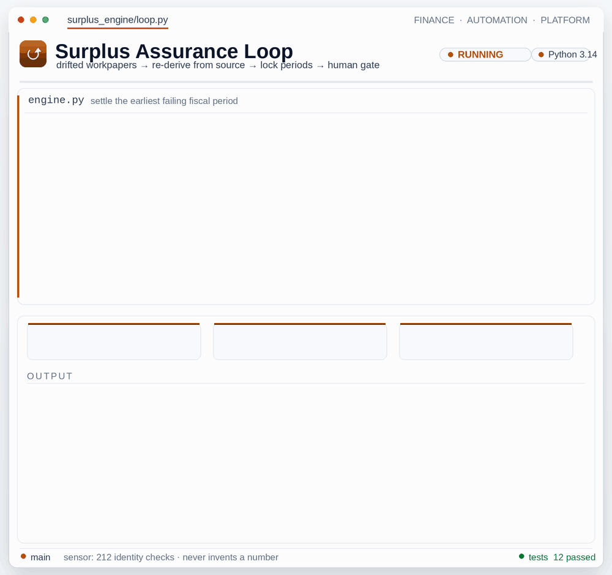

<p align="center">
  
</p>

# Sophon Finance Systems — AI-Driven Finance & Accounting Automation

[](https://github.com/sophonfinance-wq/finance-automation-portfolio/actions/workflows/ci.yml)
[](#testing)
[](#the-eight-systems)
[](https://sophonfinance.com)
[](https://codespaces.new/sophonfinance-wq/finance-automation-portfolio)
[](https://github.com/sophonfinance-wq/finance-automation-portfolio/actions/workflows/run-finance-engine.yml)
[](./LICENSE)
[](https://www.python.org/)

Eight self-contained Python systems for finance and tax work — month-end close, cash/debt
reconciliation, cross-border surplus & ACB, partnership 1065 / §704(c), read-only workbook
validation, a NotebookLM-style knowledge brain, and an interactive finance operations atlas. The
eighth is **Triangulate**, a multi-agent LLM review framework with a deterministic core and a human
sign-off gate. Everything runs on seeded
fictional data, is covered by CI, and is built on one rule: **no material output rests on a single
model's word.**

> 🔒 Fully fictional, seeded data. No employer or client workpaper, entity, methodology, path, or
> figure is reproduced.

---

## Quickstart

```bash
git clone https://github.com/sophonfinance-wq/finance-automation-portfolio
cd finance-automation-portfolio
pip install -r requirements.txt

# run the curated test suite (67,662 tests, runs in minutes)
pytest

# run a system
cd tax-surplus-engine && python -m surplus_engine --start 2021 --end 2024
```

No install? [Open it in a GitHub Codespace](https://codespaces.new/sophonfinance-wq/finance-automation-portfolio)
and run `bash scripts/demo.sh` for the full tour.

---

## For reviewers — a 60-second tour

Five commands that show the load-bearing ideas, all on fictional data:

**1. The AI control catches a hallucination.** Inject one made-up figure into a clean workpaper and watch two independent roles catch it and block sign-off:
```bash
cd ai-validation-framework && python -m triangulate --demo-adversarial
```
> An AI asserts a Total Revenue that's $49k over what the streams sum to; it cascades into the tax and net cells. The LLM-style **Reviewer** *and* an independent deterministic **Auditor** each re-derive every formula, raise **6 CRITICAL tie-out breaks**, and the human gate returns **FAIL** (exit 1). No model is asked "does this look right?" — the arithmetic decides.

**2. Real cross-border tax depth.** Per-layer FX translation surfaces a sign-flip a blended rate hides:
```bash
cd tax-surplus-engine && python -m surplus_engine --start 2021 --end 2024 --out out
# then open out/fx_layer_analysis.md  →  find the ⚑
```
> An entity contributes capital in 2023 and returns it in 2024. USD ACB nets to **$0**, and a single blended rate says CAD ACB is **$0** too — but translating each layer at its own year's rate gives **CAD $(660.35)**. The sign flips (ITA 261 / Reg. 5907). The harness checks **15 named reconciliation identities**; `--check` exits non-zero on any break.

**3. Honest, tiered tests.** `pytest` runs the curated suite (~68k, gates CI); `SWEEP=1 pytest` runs an exhaustive property sweep (~1.15M generated cases). See [Testing](#testing).

**4. Ten close controls, each proven against its own failure mode.** Inject twelve classic month-end errors — each mapped to the control that must catch it — and watch the sentinel catch every one:
```bash
cd monthly-close-automation && python -m close_engine --demo-guardrails
```

**5. The loop closes itself.** Contaminate a posted close with drift (a dropped intercompany leg, a missing accrual, a one-cent tamper) *plus* a tampered locked prior period, and watch the autonomous loop resync each category from source, re-verify, auto-post — and quarantine the locked-period tamper rather than overwrite it:
```bash
cd monthly-close-automation && python -m close_engine.loop --demo
```
> A trial balance loads with a one-sided line; a fully depreciated asset keeps depreciating; an intercompany entry loses its far leg; a clearing leg books `round(total)` instead of the sum of rounded lines; a closed period is quietly edited. The demo runs a clean baseline first (**zero findings**), then injects each fault and asserts the expected control (**C1–C10**) fires — a shadow recomputation independently re-derives every posted amount, and the run exits non-zero unless all twelve faults are caught.

---

## Architecture

<p align="center"></p>

The same control pattern runs through every system:

**seeded data → calculation engine → cited evidence → read-only validation → human verdict**

And since v1.2 the pattern *closes into a loop*: **observe → detect → remediate → re-verify →
gate → repeat.** Engines detect their own drift, re-derive it from the seeded source of record,
and re-verify — escalating only what they cannot certify. Two gate policies ship today:
human-gated on the tax-surplus engine (`python -m surplus_engine.loop --demo`) and autonomous
with quarantine on the close engine (`python -m close_engine.loop --demo`).

- **Deterministic core.** Integer-cent arithmetic, seeded generators, byte-stable outputs — the
  numbers don't move between runs, so every figure is re-derivable and diffable.
- **Separation of duties (Triangulate).** A preparer builds, a reviewer challenges, a specialist
  supports, a deterministic audit re-derives, and a human signs off. Read-only review is
  hash-enforced (any change to a workpaper raises); AI assumptions rank below source data and
  signed work; a severity→verdict gate (PASS / FLAG / FAIL) doubles as a CI exit code.
- **Human-gated.** Every AI-assisted deliverable ends at a person. An optional orchestration layer
  can coordinate longer-running work in approved, agent-enabled environments — it only adds
  throughput; the controls are what make the output defensible. The platform runs fully without it.

Full flow in **[ARCHITECTURE.md](./ARCHITECTURE.md)**.

---

## The eight systems

Every system is self-contained, deterministic, and ships with a seeded fictional-data generator.

| System | Package | Run | What it demonstrates |
|---|---|---|---|
| [Month-End Close](./monthly-close-automation/) | `close_engine` | `python -m close_engine --period 2026-03` | recurring JEs, schedule-to-GL tie-outs, debit/credit controls, a ten-control sentinel layer (completeness calendar, interco mirroring, shadow recompute, period lock — fault-injection proven via `--demo-guardrails`), refusal to post out-of-tie entries |
| [Cash & Debt Reconciliation](./cash-reconciliation/) | `recon_engine` | `python -m recon_engine` | GL-to-bank/lender matching, materiality classification, evidence log generation, plus five cash-manager controls: bank-rec bridge, outstanding/void checks, wire dual-approval, register continuity, concentration sweep |
| [Partnership 1065](./partnership-1065-automation/) | `partnership_tax` | `python -m partnership_tax` | book-to-tax bridge, 1065 / Sch. K / L / M-1 / M-2 / K-1 mapping, review checks, IRC §704(c) built-in gain (`--section704c`) |
| [Validation Engine](./audit-automation/) | `validation_engine` | `python run.py` | read-only workbook checks, formula integrity, lineage, PASS / REVIEW / FAIL verdicts, byte-identical no-write guarantee |
| [Tax Surplus / ACB](./tax-surplus-engine/) | `surplus_engine` | `python -m surplus_engine --start 2021 --end 2024` | Canadian foreign-affiliate surplus pools, distribution waterfall, per-layer FX, ITA 40(3)-style deemed gain on negative ACB |
| [Triangulate](./ai-validation-framework/) | `triangulate` | `python -m triangulate` | AI separation of duties: preparer, reviewer, specialist, deterministic audit, human gate |
| [Knowledge Brain](./knowledge-brain-engine/) | `brain_engine` | `python -m brain_engine ask "..."` | meeting transcripts → citation-governed knowledge base; verbatim, timestamped citations; review → remediation (cited change-directives + an apply-ready remediation prompt); refuses with no source |
| [Finance Operations Atlas](./finance-atlas/) | `atlas_data` + `generate` | `python generate.py` | documentation-as-artifact: a data model that renders an interactive, single-file HTML map of a finance department (drives, workstreams, directory, calendar) — deterministic output, deny-list confidentiality linting in the test suite |

**Triangulate** is the centerpiece: a framework for putting AI into financial work without letting a
single model validate its own output. Its reviewer is a live Anthropic Claude integration
(standard-library `urllib`, `claude-opus-4-8`, JSON-schema output) that swaps cleanly with a
deterministic offline mock — so the same pipeline runs air-gapped or against an approved model.

---

## Testing

The suite is **tiered** — a fast curated suite gates CI, and an exhaustive property sweep runs on
demand:

| Tier | Command | Tests | What it is |
|---|---|---:|---|
| **Curated** (default) | `pytest` | **67,662** | Hand-written unit + behavior tests and parametrized coverage across all 8 systems, including a bounded invariant grid on every engine. Runs in minutes; gates CI. |
| **Property sweep** (opt-in) | `SWEEP=1 pytest` | **~1.15M** | Exhaustive `itertools.product` grids asserting sum-preservation, exact integer round-trips, arithmetic identities, frozen-dataclass round-trips, and determinism across the full integer input domain. |

Every test calls real engine code and asserts a true property. The sweep is excluded from the
default run (and CI) for speed and generated at import — the files stay small. It's there for
exhaustive verification when you want it; turn it on with `SWEEP=1`.

Curated tests by system: close **15,687** · partnership **8,605** · triangulate **8,320** ·
recon **12,799** · tax-surplus **7,498** · knowledge-brain **7,011** · validation **4,814** ·
atlas **2,928** (including a parametrized deny-list confidentiality linter across every shipped file).

---

## Repository layout

```text
finance-automation-portfolio/
├── monthly-close-automation/     close_engine      — JEs, tie-outs, out-of-tie refusal
├── cash-reconciliation/          recon_engine      — GL ↔ bank/lender matching
├── tax-surplus-engine/           surplus_engine    — FA surplus pools, ACB, per-layer FX
├── partnership-1065-automation/  partnership_tax   — 1065 / K-1, §704(c) built-in gain
├── audit-automation/             validation_engine — read-only workbook checks
├── ai-validation-framework/      triangulate       — multi-agent LLM review + guardrails
├── knowledge-brain-engine/       brain_engine      — cited retrieval, review → remediation
├── finance-atlas/                atlas_data        — one-page department atlas (drives, workstreams)
├── docs/                         case study · walkthrough · agent operations · deployment tracks
├── assets/                       diagrams + demo GIFs
├── scripts/                      demo.sh
└── .github/workflows/            CI + runnable demo
```

Each system has its own README with the regime it models, the run commands, and sample output.

---

## See it run

<details>
<summary><b>Watch each engine run (animated demos, all on fictional data)</b></summary>

<br>

**Month-End Close Engine**
<p></p>

**Autonomous Close Loop** *(new)*
<p></p>

**Cash & Debt Reconciliation**
<p></p>

**Tax Surplus / ACB Model**
<p></p>

**Surplus Assurance Loop** *(new)*
<p></p>

**Partnership 1065 Automation**
<p></p>

**Validation Engine**
<p></p>

**Triangulate**
<p></p>

**Knowledge Brain Engine**
<p></p>

</details>

The **[Guided Demo & Walkthrough](./docs/DEMO-WALKTHROUGH.md)** shows the command to run for each
system, what to inspect, and what it proves. For how these map to specific finance, tax, and
engineering competencies, see the **[Case Study](./docs/CASE-STUDY.md)**.

---

## Stack

`Python 3.12+` · `openpyxl` · `pytest` · `Anthropic Claude API` (stdlib `urllib`, no SDK) ·
`GitHub Actions CI` · `LibreOffice headless` (Excel recalculation) · Excel-compatible workbooks ·
Markdown / JSON evidence.

No agent or orchestration dependency is required to run the demos or validate the control logic.

---

## Author

**Sophonnarith Hang** — AI Finance Engineer · Founder, Sophon Finance Systems · 18+ yrs senior
accounting & tax (Fortune 100 & 500; GAAP / FAR / CAS).
[linkedin.com/in/sophonnarith](https://www.linkedin.com/in/sophonnarith) · sophonfinance@gmail.com

## License

[MIT](./LICENSE). A public portfolio of original systems and methodology, demonstrated on fully
fictional data with all confidential engagement detail withheld.
