# 📄 Accounts Payable (`SFS-E10-APX`)

<p align="center"></p>

> A deterministic, **read-only** control engine for the accounts-payable cycle in
> construction and real-estate development — the highest-volume finance function in
> that industry, and the one with the least deterministic tooling. It reads the
> fixed-format posting artifacts the cycle already emits and runs an ordered
> registry of **30 controls in six families**, ending at a human verdict. It never
> posts, never pays, and never writes to a source artifact: it is a **sensor**, the
> deterministic ground truth other systems and reviewers consume.

> 🔒 Everything here runs on **seeded fictional data** with obviously invented
> entities ("Demo Holdings LLC", "Maple Fund LP", "Birchwood Op Co", "Cedar Ridge
> Trust", "Harborview Partners LP") and invented vendors ("Ironwood Sandbox Supply
> Co", "Foxglove Mock Freight LLC", "Harborview Demo Services Inc"). It contains no
> employer procedures, entities, vendors, identifiers or figures, and names no
> commercial software product.

---

## The problem it solves

Accounts payable is where controls are asserted most often and proven least often.
Three failure modes recur, and all three are invisible to the people running the
cycle:

**A posting run that silently did nothing.** Batch contention aborts a post; the
operator files the report as though it succeeded. The invoices never reached the
ledger — and the report still balances, because nothing moved.

**A payment released through an open compliance gate.** A first payment to a vendor
with no taxpayer certificate on file. A subcontractor draw with waivers missing from
its lower tiers. An insurance certificate that expired before the payment date.

**A routing matrix that has drifted.** A job mapped to no workflow, so its invoices
route nowhere. A workflow with no final-review group, so invoices reach payment
without an accounting sign-off. The same role-holder on both data entry and final
review — one person who can create *and* approve a payable.

Each is deterministic to detect from artifacts that already exist. None needs a
model's judgment.

## The system

Each check is a function `(Context) -> list[Finding]` registered with
`@check("rule_id")`. The registry is an **ordered list**, so report order is
deterministic. Findings carry the control rationale in the message — an exception
teaches the reason, not just the verdict.

### Input shape

The engine's input is a **posting document set**: one JSON file per entity and
period, carrying five typed source artifacts.

| `doc_type` | Stands in for |
|---|---|
| `invoice_posting_report` | the posting report a construction ERP emits after a run |
| `payment_selection_register` | the selection register produced before a pay run |
| `workflow_routing_matrix` | the routing matrix of an invoice-capture and approval-routing system |
| `information_reporting_register` | the year-end vendor register |
| `commitment_register` | the commitment and change-order journal |

Modelling each artifact as typed JSON keeps the engine stdlib-only, deterministic
and byte-stable, with no document-parsing dependency. A convenience `.xlsx`
rendering is written alongside each set when `openpyxl` is importable; it is
gitignored and never byte-compared.

### The rule registry

| Control | What it catches | Severity |
| --- | --- | --- |
| `set_complete` | **an artifact type is absent, so the controls that read it never ran** — their silence is not a passing control | `FAIL` |
| `post_proof_zero` | the posting proof figure is not zero | `FAIL` |
| `post_gl_balanced` | ledger recap debits do not equal credits | `FAIL` |
| `post_totals_balanced` | posting-total debit does not equal credit | `FAIL` |
| `post_no_rejects` | a document was rejected during the post | `FAIL` |
| `post_actually_posted` | **zero documents posted — the report balances because nothing moved** | `FAIL` |
| `post_no_error_marker` | **a blocking error aborted the run** (batch contention) | `FAIL` |
| `post_jobcost_ties` | job-cost recap does not tie to the payable cost total | `FAIL` |
| `post_header_date_agrees` | header date disagrees with the file-name stamp | `FLAG` |
| `gate_w9_on_file` | a first payment with no taxpayer certificate on file | `FAIL` |
| `gate_lien_waiver` | waivers missing from the subcontractor or its lower tiers | `FAIL` |
| `gate_insurance_current` | insurance expired before the payment date | `FAIL` |
| `gate_insurance_limits` | coverage below the contract minimum | `FLAG` |
| `gate_funding_confirmed` | funding not confirmed before release | `FAIL` |
| `gate_no_duplicate` | the same obligation selected twice in one run | `FAIL` |
| `gate_retention_present` | retention or tax lines missing / rate-inconsistent | `FLAG` |
| `gate_offcycle_approved` | an off-cycle payment with no recorded approver | `FLAG` |
| `route_every_job_mapped` | an active job maps to no workflow — invoices route nowhere | `FAIL` |
| `route_workflow_has_approver` | a workflow with no approver in its chain | `FAIL` |
| `route_final_review_present` | a workflow with no final-review group | `FAIL` |
| `route_duties_segregated` | **the same role-holder on data entry and final review** | `FAIL` |
| `route_preapproved_declared` | a direct-post workflow not enumerated as pre-approved | `FLAG` |
| `ir_threshold_coverage` | a vendor over the reporting threshold was not evaluated | `FAIL` |
| `ir_tin_present` | a reportable vendor with no taxpayer identification number | `FAIL` |
| `ir_tin_structure` | a structurally invalid identifier | `FLAG` |
| `ir_no_split_vendor` | two vendor records sharing one identifier (split-payment risk) | `FLAG` |
| `ir_filed_reconciles` | filed-form count does not reconcile to the expected list | `FAIL` |
| `cmt_sov_not_lump_sum` | a commitment entered as one lump line, not the contract schedule | `FAIL` |
| `cmt_id_convention` | a commitment identifier off the project/vendor convention | `FLAG` |
| `cmt_co_attaches_to_original` | a change order attached to no commitment in the register | `FLAG` |

**Verdict roll-up:** any `FAIL` ⇒ `FAIL`; otherwise any `FLAG` ⇒ `REVIEW`; otherwise
`PASS`. The run's overall verdict is the worst of these.

One distinction matters more than any single rule: an informational *"job-cost
entries not created"* notice is **normal** for a ledger-only invoice and is not a
failure — only a blocking error marker is. Conflating the two turns a useful control
into noise, so the engine tests both branches.

### Determinism contract

- **Integer cents everywhere**, compared with exact `==`. No tolerance band. A value
  that should be integer cents but is not produces an `AMOUNT_INVALID` finding
  rather than being coerced.
- **One seed** (`SEED = 20260731`), threaded as an explicit `rng` parameter. No
  module-level `random.*`.
- **Byte-stable artifacts.** Markdown is assembled as `lines: list[str]` joined with
  `"\n"`; JSON uses `indent=2` with no `sort_keys`. The only value that changes
  between runs is `generated_utc`, which the determinism test pops.
- Output is plain ASCII, so a legacy terminal code page needs no fallback.

## ▶️ Run it (fictional data)

```bash
cd accounts-payable-automation

# 1. generate the seeded fictional corpus, analyze it, write both artifacts
python run.py

# 2. analyze an existing folder
python -m ap_engine ./samples

# 3. regenerate first, or print only the verdict line
python -m ap_engine ./samples --generate
python -m ap_engine ./samples --quiet
```

**Exit codes:** `0` PASS · `1` REVIEW (FLAGs only) · `2` FAIL · `3` usage / IO error.
The bundled demo corpus carries one planted defect per control, so it exits `2` by
design.

### Real example output

```text
Generated 30 fictional document set(s) into .../accounts-payable-automation/samples

=== blocking_error__Maple_Fund_LP.json === verdict: FAIL
  [FAIL] post_no_error_marker @ invoice_posting_report:POST-2026-0007/error_markers:
  blocking posting error: 'batch contention on the posting queue - update aborted';
  the run did not complete and the invoices are not in the ledger

=== clean__Demo_Holdings_LLC.json === verdict: PASS
  all controls held

=== missing_w9__Harborview_Partners_LP.json === verdict: FAIL
  [FAIL] gate_w9_on_file @ payment_selection_register:PAYSEL-2026-0010/payments[PAY-2026-1001].w9_on_file:
  first payment to Ironwood Sandbox Supply Co has no taxpayer certificate on file;
  release is not permitted until it is received

=== nothing_posted__Demo_Holdings_LLC.json === verdict: FAIL
  [FAIL] post_actually_posted @ invoice_posting_report:POST-2026-0006/posted_counts.invoices:
  zero invoices posted; the report balances because nothing moved -- the run was
  filed as though it succeeded

=== duties_merged__Demo_Holdings_LLC.json === verdict: FAIL
  [FAIL] route_duties_segregated @ workflow_routing_matrix:ROUTE-2026-0021/workflows[WF-STD-02].final_review_role:
  workflow WF-STD-02 has clerk-two on both data entry and final review;
  the same role-holder can create and approve a payable
```

## ✅ Tests

```bash
cd accounts-payable-automation && python -m pytest -q     # 2,223 tests
SWEEP=1 python -m pytest -q                               # 99,223 incl. the bulk grid
```

`generate_corpus()` writes one clean baseline document set plus **exactly one planted
defect per registered control**. A test asserts
`{d.rule for d in DEFECTS} == {rule_id for rule_id, _ in REGISTRY}`, so a control
cannot be added without a fixture that exercises it, and a second asserts each
fixture trips *only* its own control.

Three contract tests guard the engine's promises: source artifacts are byte-identical
after a run (read-only), two generations from the same seed are identical, and two
report payloads agree once the timestamp is removed.

## Layout

```text
accounts-payable-automation/
├── run.py                  # zero-arg quickstart
├── ap_report.md/.json      # committed example artifacts
├── samples/                # generated corpus (.json committed, .xlsx ignored)
└── ap_engine/
    ├── model.py            # Status / Verdict / Finding / Context / DocumentReport
    ├── money.py            # integer cents; exact comparison, no tolerance
    ├── engine.py           # the 30 controls + ordered registry + runner
    ├── generate.py         # seeded fictional corpus, one defect per control
    ├── report.py           # byte-stable markdown + JSON
    ├── cli.py              # argparse only; main(argv) -> int
    └── tests/
```

## What this demonstrates

A control engine is only credible if it can be wrong in public. This one ships the
defects it claims to catch, proves each control fires on its own fixture and stays
silent on a clean one, and refuses to express money as anything but integer cents.

It has no remediation loop, deliberately. Resyncing to authority and booking
adjustments is a mutation, and this engine is read-only — it is the *sensor* other
loops consume, not an actor. Everything it finds ends at a person.
