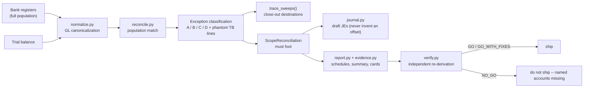

# Cash Completeness Engine

> **Bank-population-first reconciliation with built-in independent verification.**
> Starts from the full bank-register population, classifies every exception,
> drafts only the journal entries it can prove, and refuses to ship any report
> whose population does not foot.

> This project uses **100% fictional data** -- invented entities, invented banks,
> invented GL codes, invented balances. It demonstrates a reconciliation
> methodology, not any real company's books.

---

## The problem it solves

The standard month-end cash reconciliation starts from the **trial balance**: walk
the TB's cash lines, agree each one to a bank statement, done. That procedure has
a structural blind spot -- **it literally cannot see accounts that are missing from
the TB.** If a bank migration opens successor accounts that never get mapped to a
GL line, or a closed account's final sweep never gets booked, the TB-first recon
reports "clean" while real cash sits fully outside the ledger.

Completeness has to run in the other direction:

1. **Start from the bank side.** The register population -- every account the
   banks say exists -- is the denominator.
2. **Reconcile the full population**, not just the lines the TB happens to carry.
3. **Classify every exception.** Nothing is silently dropped; "unexplained" is a
   category, not an omission.
4. **Independently verify the report before it ships.** A second, separately
   coded pass re-derives the population from raw inputs and cross-foots every
   claim the report makes.

## What it does

- **Population match.** Loads every bank register (the full population) and the
  trial balance, canonicalizes GL keys (`615-001-00-1133`, `615-001-1133`, and
  `6150011133` all normalize to `615-001-1133`), and matches register accounts to
  TB rows.
- **Four-way exception classification.** Every register/TB mismatch lands in
  exactly one bucket:
  - `A_UNMAPPED_SUCCESSOR` -- a live register account with **no TB row at all**
    (the classic post-migration miss).
  - `B_STALE_CLOSEOUT` -- the TB still carries a balance for an account the bank
    shows closed and swept to ~0.
  - `C_TIMING` -- live account where post-cutoff / deposit-in-transit activity
    fully explains the difference.
  - `D_UNEXPLAINED` -- anything else. Never silently dropped.
- **Sweep tracing.** For close-outs, `trace_sweeps()` parses the closing
  transactions ("Transfer to ...", "Wire to ...", "To close account") and names
  the **destination and amount** of every dollar that left -- the stale TB figure
  must equal the pre-sweep balance.
- **A scope reconciliation that must foot.** Every register account is assigned
  to exactly one bucket, and the buckets must re-add to the full population. A
  `foot()` method returns the named problems; an empty list is the only passing
  grade.
- **Draft journal entries with never-invent-offset discipline.** A JE is `ready`
  only when both the amount **and the offset** are fully documented (sweep
  destinations traced). If the offset is not proven, the engine emits
  `needs_judgment` with the precise question for the reviewer -- it never guesses
  a plug account. Phantom TB lines get `no_entry: retire the line`. Every
  line-bearing draft balances to the cent, by assertion.
- **Placeholder-GL review flag.** A register account can tie to the TB to the
  cent and still be booked against a mis-keyed placeholder key (the
  `001-001-...` pattern). `flag_placeholder_gls()` surfaces those accounts in
  the scope reconciliation and executive summary -- they keep their scope
  bucket, but the suspicious key still reaches a reviewer instead of passing
  silently as a clean tie.
- **Evidence cards.** One card per exception: verbatim transaction table,
  highlighted sweep rows, and a "TIES" footer -- rendered as PNG (matplotlib, if
  available) or self-contained HTML, with an `INDEX.html` gallery either way.
- **An independent verifier that can say NO-GO.** `verify.py` re-derives the
  population from the raw registers with its **own** logic (it does not import
  the classifier), then cross-foots the report: every register account must
  appear in the scope reconciliation exactly once, and every total must re-add.
  Any omission is a `NO_GO` with the missing accounts named.



## Quickstart

**Requirements:** Python 3.10+. The core is **stdlib only**; `openpyxl` (xlsx
ingestion) and `matplotlib` (PNG evidence cards) are optional -- the engine
degrades gracefully without them.

```bash
# from this folder:
python run.py demo        # run the full pipeline on the bundled fictional data
python -m pytest -q       # run the test suite
```

The demo models a fictional bank migration: **First Legacy Bank** accounts closed
and swept into successor accounts at **Union National Bank** (plus a third bank,
**Coastal Mutual**), across entities like Juniper 42 Development LLC, Harbor 17
Investor LLC, and Wrenfield 28 Development LLC. Some successor accounts were
never mapped to the TB; some closed accounts still show stale TB balances; one TB
cash line was mis-keyed and matches no register at all.

### What it produces

- `resolution_schedule.md` -- every exception, grouped by classification, with
  traced sweep destinations.
- `exec_summary.md` -- leads with the only question that matters: *"Is any
  dollar unaccounted for?"*
- `scope_reconciliation.md` -- the population footing: every register account in
  exactly one bucket, buckets re-adding to the whole.
- `journal_entries.csv` -- the drafts, tagged `ready` / `needs_judgment` /
  `no_entry`.
- Evidence cards (PNG or HTML) with an `INDEX.html` gallery.

### Sample output (excerpt, fictional)

Scope reconciliation -- the table that must foot:

| Bucket | Accounts | Register total |
|---|---:|---:|
| matched_clean | 14 | 4,182,336.90 |
| A_UNMAPPED_SUCCESSOR | 3 | 512,004.17 |
| B_STALE_CLOSEOUT | 2 | 0.00 |
| C_TIMING | 2 | 88,410.55 |
| D_UNEXPLAINED | 0 | 0.00 |
| **Total (= full register population)** | **21** | **4,782,751.62** |

Plus one TB row flagged `phantom_or_no_register` -- a mis-keyed cash line
(`001-001-1010`) that matches no bank account and should be retired, not
reconciled.

Independent verification (the gate every report passes before it ships):

```text
Independent verification: GO
  population ..... 21/21 register accounts appear exactly once in scope reconciliation
  totals ......... all bucket totals re-add from the raw registers
  exceptions ..... 7 classified (3 A / 2 B / 2 C / 0 D), 0 unexplained
```

And what it looks like when a report overclaims:

```text
Independent verification: NO_GO
  FINDING (critical): report claims a complete population but omits 2 register
  accounts: 610-002-1010 (Wrenfield 28 Development LLC, Union National Bank),
  610-002-1015 (Saltgrass 6 Services LLC, Coastal Mutual)
  fix: re-run the reconciliation over the full register directory; do not ship.
```

## Why the verifier is the point

Born from a real month-end close -- the first draft of the real report claimed a
complete population, and an independent verification pass proved it was not; that
check is now a feature. The verifier is deliberately coded as a second
implementation: it re-derives the population from the raw inputs rather than
trusting the classifier, so a bug or an omission in the pipeline cannot vouch for
itself. All data here is fictional.

## Layout

```text
cash-completeness-engine/
|-- models.py        # shared data contracts (Transaction, RegisterAccount, TBRow,
|                    #   ExceptionItem, ScopeReconciliation, Verdict)
|-- normalize.py     # GL canonicalization + placeholder detection
|-- ingest.py        # CSV loaders (optional openpyxl xlsx variants)
|-- reconcile.py     # population match, A/B/C/D classification, sweep tracing
|-- verify.py        # independent verifier -- re-derives, cross-foots, GO / NO_GO
|-- journal.py       # JE drafts: ready / needs_judgment / no_entry, balanced to the cent
|-- report.py        # resolution schedule, exec summary, JE csv, scope reconciliation
|-- evidence.py      # per-exception evidence cards (PNG or HTML) + INDEX.html gallery
|-- run.py           # demo entrypoint (python run.py demo)
|-- demo_data/       # fictional registers + trial balance
`-- tests/           # pytest suite
```

| Module | Role |
|---|---|
| `models.py` | Typed data contracts every module codes against |
| `normalize.py` | `normalize_gl()` canonical keys; `is_placeholder_gl()` flags mis-keyed rows |
| `ingest.py` | `load_registers(dir)`, `load_trial_balance(path)`; xlsx variants when openpyxl is present |
| `reconcile.py` | Population match, exception classification, `trace_sweeps()` |
| `verify.py` | `independent_verify()` -- the crown jewel; separate logic, hard NO-GO |
| `journal.py` | `draft_entries()` -- never invents an offset, asserts balance |
| `report.py` | `build_report()` + the four Markdown/CSV deliverables |
| `evidence.py` | Evidence cards with graceful matplotlib fallback |

---

> Everything above -- entities, banks, account keys, balances, transactions -- is
> **invented for this portfolio demo**. It demonstrates a generic
> bank-population-first completeness methodology and reproduces no real entity,
> person, methodology, or data.
