# 24/7 Agent Operations Layer

This is the advanced operating model for clients that approve agentic tooling: AI-driven finance
automation that runs around the clock, with deterministic controls and a human gate that never moves.

The idea is a finance automation command center: a mobile command channel, dedicated Mac mini
worker nodes, Hermes/OpenClaw orchestration, AI coding and review assistants, seven finance systems
underneath, and a final executive package at the end.

<p align="center"></p>

---

## The sales version

Send the request from your phone. The agent desk receives it. Mac mini workers keep the workspace
online. Hermes/OpenClaw coordinate the work. Codex/Claude-style assistants can support coding,
review, or drafting where approved. The seven finance systems run underneath. Validation checks the
output. Triangulate challenges the work. Status comes back to the phone, and the system packages the
result for leadership.

The output is not just a workbook. It is a report, an exception list, a validation status, and a
CEO-ready email draft for human approval.

---

## Command channels

### Mobile / Telegram

For approved environments, a private Telegram channel can act as the command line for finance
operations:

- start a close run
- request a reconciliation review
- ask for a surplus / ACB package
- check the status of a background review queue
- receive exception summaries
- receive finished-package status
- approve or reject a drafted executive email

Telegram is the convenient mobile layer, not the control system. The control system is still the
evidence, logs, validation, and human approval policy.

### Codex / Claude mobile or remote access

Where a user wants direct AI assistance from a phone, mobile access to Codex/Claude-style tools can
serve as another command surface:

- ask the coding assistant to adjust a rule
- ask for a narrative explanation of a finding
- request a draft client memo
- queue a fix packet for the Mac mini workers

The mobile device becomes the steering wheel. The Mac mini workers do the long-running work.

---

## Worker layer: dedicated Mac Minis

The Mac mini layer is the always-on operations desk.

| Layer | Purpose |
|---|---|
| Mobile device | sends commands, receives status, approves final action |
| Telegram / approved command channel | lightweight intake and updates |
| Mac mini worker nodes | keep agents and local workspaces online 24/7 |
| Hermes / OpenClaw | coordinate multi-step agent workflows |
| Codex / Claude-style assistants | support coding, review, drafting, and reasoning |
| Finance engines | run close, reconciliation, tax, validation, and AI review |
| Human gatekeeper | final sign-off, approval, and judgment |

This is useful because finance work often has long waits: exports, source gathering, evidence
packaging, review loops, and exception analysis. The worker layer can keep moving while the user is
not sitting in front of the machine.

---

## How the seven systems fit underneath

The agent layer does not replace the systems. It orchestrates them.

| System | What the agent layer can do |
|---|---|
| Close Engine | run the close package, collect outputs, flag out-of-tie entries |
| Reconciliation Engine | run bank/lender matching, summarize flagged reconciling items |
| Surplus / ACB Engine | generate workpapers and summary packages for the tax model |
| Partnership 1065 Automation | build the 1065 support package, K-1 preview, review checks, and summary draft |
| Validation Engine | run read-only checks and turn failures into exception language |
| Triangulate | route work through preparer, reviewer, specialist, audit, and human gate |
| Knowledge Brain | ask for prior decisions, assemble meeting prep, and pull verbatim, timestamped citations for workpapers — or surface its refusal when no source qualifies |

The value is not just automation. The value is controlled automation.

---

## CEO-ready reporting

<p align="center"></p>

When the systems finish, the agent layer can produce an executive package:

- subject line
- greeting and correct title
- one-paragraph executive summary
- key findings
- exceptions requiring decision
- validation status
- files produced
- recommended next step
- attachments or links
- draft email to CEO, CFO, controller, or reviewer

Example structure:

```text
Subject: March Close Automation Review - Exceptions and Sign-Off Items

Hi [CEO/CFO Name],

The March close automation package has completed. The system generated the JE register,
trial balance tie-out, validation report, and exception summary.

Status: REVIEW
Key findings:
- Two reconciling items exceed the materiality threshold.
- One intercompany tie-out requires controller review.
- No formula integrity failures were detected in the close workbook.

Recommended next action:
Please review the attached exception summary and approve the controller follow-up items.

Regards,
[Sender]
```

For conservative environments, this is a draft for approval. For approved environments, routing or
sending can be policy-controlled.

---

## Controls that keep it professional

The system should be exciting, but not reckless.

- no final email send unless the approval policy allows it
- no confidential data in public demos
- source files and outputs remain traceable
- deterministic checks run before executive summaries
- AI-generated assumptions rank below source data and signed work
- human gatekeeper stays responsible for final sign-off
- IT can choose the enterprise-safe mode if agents are not allowed

---

## Enterprise-safe fallback

If a company says no to Hermes, OpenClaw, Telegram, or always-on Mac mini agents, the same portfolio
still works:

1. Run the Python engines manually or through CI.
2. Generate Markdown/JSON/.xlsx evidence.
3. Run the validation engine.
4. Use Triangulate in offline/mock mode.
5. Draft the executive package manually or with approved tools.
6. Human reviewer sends the final email.

The advanced setup makes it faster. The core control framework makes it defensible.
