# Guided Demo & Walkthrough

A live demo script for AI-driven finance and tax automation. Each section gives the command to run,
what to point at, and what the system proves.

All data is fictional and seeded. Nothing here references a real entity, person, or figure.

---

## 60-second framing

> "This repository is fourteen runnable systems that automate the finance work teams still do by hand:
> close, reconciliation, partnership tax prep, complex international tax modeling, read-only workbook
> validation, a citation-governed knowledge brain over meeting transcripts, and an interactive finance
> operations atlas. Above that sits an AI
> review layer (Triangulate) with separation of duties and an optional orchestration layer. A request
> runs the finance systems, validates the results, and drafts an executive-ready summary. The demo
> uses fictional data, but the control architecture — deterministic engines, read-only validation,
> human sign-off — is the same pattern a production deployment would use. Let me show you."

---

## Setup

```bash
git clone https://github.com/sophonfinance-wq/finance-automation-portfolio
cd finance-automation-portfolio
python -m pip install -r requirements.txt
python -m pytest -q
```

**Point at:** the test count.

**What it proves:** the behavior is pinned by automated tests, not hand-waved.

---

## 1. Month-End Close Engine

```bash
cd monthly-close-automation
python -m close_engine --period 2026-03 --out ./output
```

**Point at:** `Close status: CLEAN` and `output/je_register.md`.

**Key behavior:** show that the intercompany legs self-balance and that the engine refuses to
post out-of-tie entries instead of forcing a plug.

**What it proves:** close automation can be repeatable, controlled, and reviewable.

---

## 2. Cash & Debt Reconciliation Engine

```bash
cd cash-reconciliation
python -m recon_engine
```

**Point at:** `evidence-log.md`, especially the flagged-for-review section.

**Key behavior:** the sample plants multiple discrepancies. The engine separates immaterial
timing from items that need review.

**What it proves:** materiality logic and evidence logs can be automated.

---

## 3. Tax Surplus / ACB Model

```bash
cd tax-surplus-engine
python -m surplus_engine --start 2021 --end 2024 --out out --xlsx
```

**Point at:** `out/workpaper_CEDAR_MEZZ.md`, especially surplus movement and ACB behavior.

**Key behavior:** the ACB ledger moves only on capital events, while operating income moves
through the surplus logic.

**What it proves:** hard cross-border tax logic can be made traceable and reusable.

---

## 4. Partnership Tax · Form 1065

```bash
cd partnership-1065-automation
python -m partnership_tax
```

**Point at:** `output/tax_workpapers.md`, `output/review_checks.md`, and
`output/form_1065_preview.json`.

**Key behavior:** the system turns a fictional source bundle into a 1065 workpaper bridge, maps
the return lines, allocates K-1 preview amounts, and runs checks before calling the package READY.

**What it proves:** tax prep can be treated like a controlled production system: source intake,
mapping, allocations, review checks, and management-ready explanation.

---

## 5. Validation Engine

```bash
cd audit-automation
python run.py
```

**Point at:** the per-workbook PASS / REVIEW / FAIL verdicts.

**Key behavior:** the checker is read-only. Tests hash files before and after validation so the
validator cannot corrupt what it checks.

**What it proves:** deterministic verification is more reliable than asking an AI whether a workbook
appears correct.

---

## 6. Triangulate

```bash
cd ai-validation-framework
python -m triangulate                 # defective sample -> VERDICT: FAIL
python -m triangulate --sample clean  # clean sample     -> VERDICT: PASS
```

<p align="center"></p>

**Point at:** the fix packet and verdict.

**Key behavior:** the reviewer can flag but cannot silently fix. The role is structurally
read-only, and the orchestrator checks that the workpaper digest did not change.

**What it proves:** AI review can be designed with structural separation of duties rather than
unverified judgment.

---

## 7. Knowledge Brain Engine

```bash
cd knowledge-brain-engine
python -m brain_engine                                                           # print the brain index
python -m brain_engine ask "how is return of capital beyond basis treated?"      # cited answer
python -m brain_engine --cite "return of capital in excess of basis is a deemed gain"  # paste-ready footnote
python -m brain_engine --prep "warranty reserve book-tax treatment"              # meeting-prep briefing
python -m brain_engine remediate "Surplus Workpaper Review — Reviewer Corrections"  # cited directives + apply-ready fix prompt
```

**Point at:** the citation block — `[Title — Date — HH:MM:SS — Speaker]` — and the refusal banner
when you ask for something the brain has no source for.

**Key behavior:** it cites verbatim with a timestamp, and it refuses to guess. Ask for a parking
or lunch policy and the brain returns its refusal banner instead of inventing an answer. Then run
`remediate` and watch a review meeting's spoken corrections become cited change-directives plus an
auto-generated, apply-ready remediation prompt — and a change-log mapping each directive → source →
status — that a downstream AI or operator uses to apply the changes.

**What it proves:** institutional memory becomes citation-grade — meeting decisions become quotable,
sourced, and traceable into workpapers and disclosure notes — and a reviewer's recorded corrections
drive their own remediation, with the transcript itself as the instruction set.

---

## 8. Optional orchestration layer

Open **[Agent Operations](./AGENT-OPERATIONS.md)**.

**Point at:** the orchestration-layer diagram and the status cues in the engine GIFs.

**Key behavior:** the platform can run two ways:

- **Agent-enabled:** in approved environments, an optional orchestration layer coordinates
  longer-running work, manages background review passes, and routes status updates back to the
  operator, with the finance systems running underneath — all through the same controls.
- **Enterprise-safe:** where agents are not permitted, the same engines, tests, validation, and
  human-gated workflow run fully without any orchestration dependency.

**What it proves:** this is not prompt usage. It is finance operations architecture: intake,
orchestration, controls, evidence, review, escalation, and executive communication.

---

## 9. CEO-ready output package

Open the CEO-ready reporting section in **[Agent Operations](./AGENT-OPERATIONS.md)**.

<p align="center"></p>

**Point at:** the executive package diagram.

**Key behavior:** the workflow does not stop when the report exists. It can produce the summary,
findings, exceptions, validation status, recommended next action, and CEO/CFO-ready email draft.

**What it proves:** the system goes from command to workpaper to validation to leadership
communication.

---

## Optional: record a 30-second demo GIF

The repo already embeds demo GIFs. To capture a live demo:

1. Use ScreenToGif or Xbox Game Bar on Windows.
2. Open a clean terminal in the repo.
3. Record:

```bash
python -m pytest -q
cd monthly-close-automation
python -m close_engine --period 2026-03
cd ../partnership-1065-automation
python -m partnership_tax
cd ../ai-validation-framework
python -m triangulate
```

Trim to the moments that land: tests pass, close status clean, and Triangulate returns FAIL on the
defective sample.

---

## The close

> "Every one of these systems is on GitHub, runs on synthetic data, and is covered by tests. The
> real engagements behind them remain confidential. The public version is enterprise-safe. Where a
> client approves agent tooling, the same system can be accelerated with an optional orchestration
> layer that coordinates longer-running work and executive-ready reporting through the same controls."
