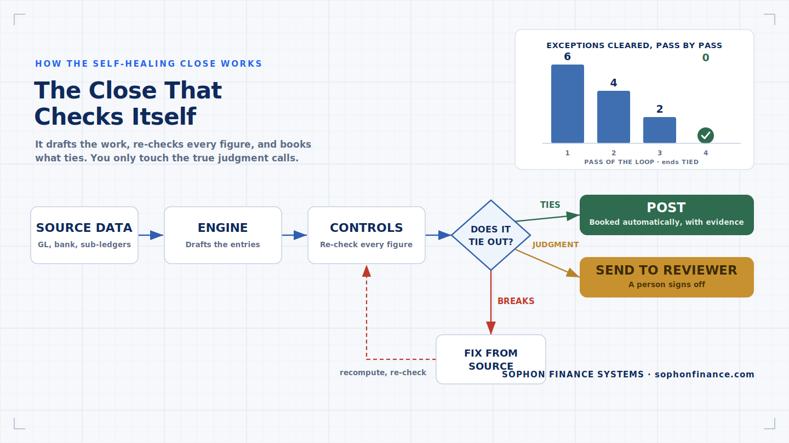
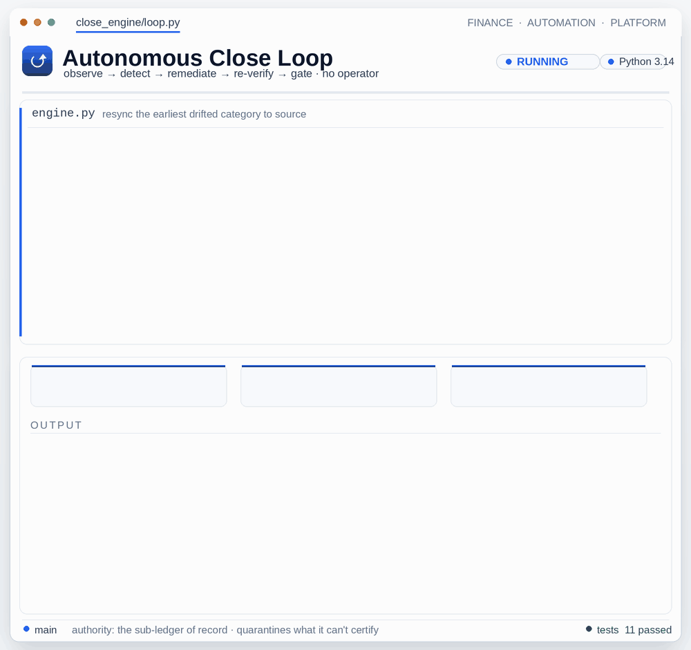

# 📅 Month-End Close Automation

<p align="center"></p>
<p align="center"></p>

> The platform converts a slow, manual month-end close into an **AI-assisted, repeatable,
> documented, single-operator workflow** — even across large multi-entity groups
> on multiple accounting databases.

> 🔒 This page describes the platform's **approach and capabilities**, and ships a small,
> **fully runnable engine on fictional data**. It does not reproduce any
> employer's specific close procedures, entities, or figures.

---

## The problem it solves
Month-end close at a large entity group is a recurring operational burden: many interdependent
recurring journal entries, each with its own logic, spread across multiple operating
entities and separate databases. Run from memory or a static spreadsheet, errors accumulate and
the close extends for days.

The failures that hurt most are the **silent** ones: a recurring accrual that quietly stops
posting, a fully depreciated asset that keeps depreciating, an allocation driven by a
cumulative balance instead of the month's activity. Each looks exactly like a clean close —
until someone finds it quarters later.

## Approach
- **Codify the close as portable knowledge.** The platform captures the entire close — the entity map,
  the recurring-entry logic, the chart-of-accounts exceptions, and the exact output format — in
  structured SOPs, so it runs consistently for any operator (or a fresh AI session)
  without re-learning the process.
- **One universal rhythm for every recurring entry:** *check the ledger for new activity →
  update a formula-driven schedule → record the entry → tie the schedule back to the ledger.*
  Nothing posts unless it ties.
- **A close that cannot silently go wrong.** Every posted entry must survive ten deterministic
  controls — Close Sentinel — before it counts, including an independent shadow recomputation
  of every amount from the raw data.
- **Audit-ready by construction.** Formula-driven schedules (never hardcoded), immutable
  historical tabs as the audit record, and a cited evidence trail on every value touched.
- **Operator-grade and resilient.** Plain-English steps, a single recommended action (not a
  menu), and a hard rule that an out-of-tie schedule halts the process.

## Classes of recurring entries automated
At a capability level (no employer specifics): prepaid amortization, fixed-asset
depreciation, deferred-rent / CAM allocations, fixed-fee accrual rollforwards,
management-fee accruals, note-payable
interest accruals (including multi-leg intercompany interest *capitalization*), G&A cost
allocations, prepaid-insurance allocations, and exact-route postage meter allocations —
each as deterministic, tie-checked logic.

## What this demonstrates
- Reduces a **multi-day manual close to a repeatable workflow** a single operator can run.
- Handles **genuinely complex entries** — for example, multi-database, multi-leg
  intercompany interest capitalization that must balance independently in each ledger.
- **Control design, not just computation** — ten deterministic close controls that encode
  the month-end failure modes every controller recognizes: the missed accrual, the one-sided
  intercompany entry, the asset depreciating past its useful life, the cumulative balance
  used as an allocation driver.
- **Detection proven, not asserted** — a fault-injection demo (`--demo-guardrails`) injects
  twelve classic close errors covering all ten controls and shows each one caught by the
  specific control designed for it.
- Built for **handoff and audit**, not merely to complete the current month.

---

## ▶️ Run it

This repository ships a small but **fully working** month-end **close engine** on
**fictional** data. It generates a synthetic entity group, computes the recurring
journal entries, enforces tie-out controls, runs the Close Sentinel control suite,
and writes a JE register, structured backing schedules, an updated trial balance,
and a close report.

**Requirements:** Python 3.12+, `openpyxl` (already installed). Tests
use `pytest`. No pandas/numpy/faker — stdlib only, seeded for determinism.

```bash
# From this folder. (Optional) install pytest for the test suite:
python -m pip install --quiet pytest

# 1) Inspect the seeded synthetic dataset
python -m close_engine.generate --period 2026-03 --seed 2026

# 2) Run a full close for a period (writes ./output)
python -m close_engine --period 2026-03 --out ./output
#   ...or, equivalently:
python run.py --period 2026-03 --out ./output

# 3) Prove the controls: inject twelve classic close errors, watch each get caught
python -m close_engine --demo-guardrails

# 4) Preflight a recurring-entry register without posting or importing it
python -m close_engine.recurring_register --input samples/sample-recurring-register.json

# 5) Run the tests
python -m pytest -q
```

The CLI **exits non-zero** if the close is not clean (any out-of-tie entry, a
failed schedule tie-out, or an unbalanced trial balance), so it can gate a pipeline.
Close Sentinel runs by default (`--no-sentinel` to skip); any **CRITICAL** control
finding also fails the run.

### Read-only recurring-register preflight

`close_engine.recurring_register` is a separate validation-only boundary for a
controller-maintained recurring JE register. It reads a generic JSON register,
validates it, and returns `PASS` or `NEEDS REVIEW`. It never creates journal
entries, touches the ledger, constructs an ERP import payload, or changes the
source file.

The preflight applies five deterministic gates:

| Gate | What it proves |
|------|----------------|
| **Exact period** | The target and every row use canonical `YYYY-MM`; a prior-period row is explicitly stale. |
| **Row identity** | `(entry_id, line_id)` is unique and required identifiers are nonblank and already trimmed. |
| **Stale memo** | Any canonical period token in a memo must equal the target period. |
| **Safe amounts** | Amounts are nonnegative integer cents. Floats, booleans, text, formulas, nonfinite values, and spreadsheet error tokens are rejected instead of coerced. |
| **Balance** | Every entry group balances independently, then the full register crossfoots globally; offsetting group errors cannot hide in a clean global net. |

```text
Recurring-register preflight - 2026-03
  Rows             : 4
  Entry groups     : 2
  Debits / credits : 205000 / 205000 cents
  Findings         : 0
  Posting actions  : 0 (validation only)
  Import payloads  : 0 (validation only)
  Verdict          : PASS
```

The public schema is intentionally generic and the sample is entirely
fictional. No workbook layout, company process, account mapping, or import
connector is encoded in this validator.

### Construction budget-variance preflight (validation only)

`close_engine.budget_variance` independently re-derives a fictional project's
cost-code mechanics using integer cents: current budget equals original budget
plus approved changes; current cost to complete equals current budget less costs
to date; revised budget equals current budget plus the period update; and revised
cost to complete equals revised budget less costs to date. It also detects
duplicate cost codes, unsafe amount types, negative cost-to-complete overruns,
missing or stale overrun flags, and project totals that do not crossfoot to the
detail.

This component is intentionally read-only. Even a mechanically clean result is
only `READY FOR HUMAN REVIEW`: source-system refresh and tie, commitment
completeness, project-manager/change-order approval, and the approved forecast or
pro forma update remain manual gates. It never creates a journal entry, import
payload, posting action, or source-system mutation. The example names and amounts
are entirely fictional, and the public module does not encode a private workbook
layout.

### What the engine computes
Nine classes of recurring entries, each with a backing schedule and a hard
debits == credits control (and per-entity balance for intercompany entries):

| Entry | Logic |
|-------|-------|
| **Prepaid amortization** | straight-line over each item's service period |
| **Fixed-asset depreciation** | straight-line, monthly, no salvage |
| **Deferred rent + CAM** | rent straight-lined vs. escalating cash rent; cost shared across entities by a fixed split routed through intercompany **due-to / due-from** |
| **Fixed-fee accrual** | beginning payable less settlements already in the GL, plus the monthly fee and a signed approved adjustment; the engine posts only the accrual so settlements are never double-booked |
| **Management-fee accrual** | full monthly fee, **netting** any in-month cash payment |
| **Note interest accrual** | simple monthly interest, with the lender/borrower **intercompany mirror** |
| **G&A allocation** | fixed ratio that **must sum to 100%** (largest-remainder split, no penny lost) |
| **Prepaid-insurance allocation** | shared policies amortized monthly across entities by fixed basis-point splits (largest-remainder, exact to the cent), with a **mid-year renewal step-up** — the applicable premium switches to the renewal rate starting in the renewal month |
| **Postage allocation** | signed meter detail must match **exactly one** approved project/job/cost route; blank, noncanonical, unknown, or duplicate identifiers refuse the whole batch, refunds reverse expense and intercompany legs, and account 1460 must clear separately in every entity |

All money is held as **integer cents** so tie-outs are exact. Allocation ratios are
validated to sum to exactly 100% (10000 bps) before anything posts.

---

## 🛡️ Close Sentinel — ten deterministic controls

**Thesis: a close that cannot silently go wrong.** Computing the right numbers is
half the job; the other half is proving nothing slipped past. Every entry must
survive ten deterministic controls before it counts. Each control encodes a
month-end failure mode a controller will recognize on sight, expressed generically
and verified independently of the code that posted the entry. Findings are graded
**CRITICAL / WARN / INFO**; a single CRITICAL blocks the close. Detection is proven,
not asserted: the fault-injection demo below drives twelve injected faults across
all ten controls.

| ID | Control | The close failure it blocks |
|----|---------|-----------------------------|
| **C1** | Re-balance | An entry — or a trial balance — that does not foot. The opening trial balance must net to zero group-wide, every posted entry must re-add from its raw lines (in aggregate and per entity leg), and the post-close ledger trial balance must still balance — all re-summed independently of the posting code, so an imbalance cannot be vouched for by the same code that created it. |
| **C2** | Intercompany mirror | The one-sided intercompany entry: the due-from booked in one entity, the due-to never booked in the other. Both legs must exist and must mirror to the cent — the kind of gap that otherwise surfaces only at consolidation. |
| **C3** | Completeness calendar | The silently missing accrual — and its twin, the entry posted twice. The expected set of (entity, entry) pairs is derived from the sub-ledgers each period; anything missing or duplicated is named. Explicit waivers are recorded, not assumed. |
| **C4** | Asset-life guard | The fully depreciated asset that keeps depreciating, and accumulated depreciation exceeding cost. Remaining life is recomputed for every asset, and the accumulated balance is re-derived from the sub-ledger and the posted register — never from the workpaper schedule, so a doctored schedule cannot vouch for it. The monthly overstatement and the exact over-accrual (the reversal candidate) are quantified in cents. |
| **C5** | Driver provenance | The allocation driven by a cumulative balance instead of the period's activity. The driver is recomputed from the sub-ledger; a YTD balance quietly standing in for the month's activity is called out with both numbers. |
| **C6** | Cross-foot | Stranded cents and stale splits. Per policy, the entity shares must sum exactly to the monthly total — which catches a renewal step-up whose entity rows were left at the old premium — and every allocation split map must pass dataset integrity: exactly 100.00%, naming only entities inside the group. The engine refuses to post on an invalid map instead of crashing; this control independently blocks the close. |
| **C7** | Step-change corroboration | The unexplained jump — or drop — that flows through on autopilot. A movement over 20% and over $100 (absolute delta, either direction) versus the prior period must trace to a real sub-ledger event of the **same entity** (a renewal, a new asset in service, a new prepaid, an item expiring or reaching end of life); an explained step is noted, an unexplained one is flagged for the reviewer. |
| **C8** | Rounding policy | The one-cent drift between detail and summary. The clearing leg must equal the **sum of the rounded per-line amounts** — never `round(total)` — so multi-line allocations reconcile exactly. |
| **C9** | Shadow recompute | A defect — or a tamper — in the posting path. An independent minimal re-implementation recomputes every expected amount from the raw data; the posted register must agree to the cent. Two independent computations must agree before anything counts. |
| **C10** | Period lock | The closed period quietly rewritten. Each closed register is sealed with a hash; any later mutation of a locked period is detected on recompute. |

Sentinel results are written alongside the close outputs: the close report gains a
**Control findings** section (or "All controls passed" on a clean run), plus a
machine-readable findings JSON.

### Fault-injection demo

```bash
python -m close_engine --demo-guardrails
```

The demo first runs a clean baseline — which must produce **zero** findings — then
injects twelve classic close errors one at a time and asserts that the expected
control catches each. A fault counts as caught only when its expected control fires
at a qualifying severity: CRITICAL for the blocking controls, WARN or above for the
reviewer-escalation control C7 (whose fault is independently blocked by the C9
shadow recompute). The command exits 0 only if the baseline is clean **and** all
twelve faults are caught:

```
Close Sentinel guardrail demo - period 2026-03 (seed 2026)
  baseline (no fault)            -> PASS: zero findings on clean data
  unbalanced_opening             -> PASS: caught by C1 re_balance (CRITICAL): opening trial balance out of balance
  ended_asset_keeps_depreciating -> PASS: caught by C4 asset_life_guard (CRITICAL): fully depreciated asset still depreciating
  accumulated_over_cost          -> PASS: caught by C4 asset_life_guard (CRITICAL): accumulated depreciation exceeds cost
  balance_as_driver              -> PASS: caught by C5 driver_provenance (CRITICAL): cumulative balance used as allocation driver
  stale_renewal_row              -> PASS: caught by C6 crossfoot (CRITICAL): entity shares do not crossfoot to the policy monthly total
  missing_recurring_entry        -> PASS: caught by C3 completeness_calendar (CRITICAL): expected recurring entry absent
  duplicate_entry                -> PASS: caught by C3 completeness_calendar (CRITICAL): duplicate recurring entry
  interco_one_sided              -> PASS: caught by C2 interco_mirror (CRITICAL): one-sided intercompany entry
  uncorroborated_step            -> PASS: caught by C7 step_change (WARN): unexplained step change
  rounded_total_leg              -> PASS: caught by C8 rounding_policy (CRITICAL): rounding drift between detail and clearing leg
  shadow_tamper                  -> PASS: caught by C9 shadow_recompute (CRITICAL): shadow recomputation disagrees
  prior_period_mutation          -> PASS: caught by C10 period_lock (CRITICAL): closed period mutated
  Demo verdict: ALL GUARDRAILS HELD (12 faults, baseline clean)
```

Every fault injector is seeded and deterministic, and each maps to exactly one
control — so the demo doubles as living documentation of what each control is for.
The twelve faults cover all ten controls; C3 and C4 are each proven against two
distinct failure modes. Injectors with period preconditions guard themselves:
before any policy has incepted, the renewal fault substitutes a same-class
crossfoot corruption, so the demo holds at any valid period.

### 🔁 Autonomous Close Loop (`loop.py`)

<p align="center"></p>

<p align="center"></p>

The Sentinel *detects*; today a human works the exception list and re-runs. The
**Autonomous Close Loop** closes that loop and takes the operator out of it —
without pretending the controls no longer matter. The seeded sub-ledger is the
system of record (the controls already re-derive against it), so
`CloseEngine(dataset).run()` is the authoritative close. Given a *drifted* posted
register, the loop runs:

**observe → detect → remediate → re-verify → gate → repeat**

Each turn it finds the earliest recurring-entry **category** whose posted lines
disagree with the authoritative re-derivation, resyncs that category (booking the
line-level movement as adjustments), rebuilds the trial balance, and re-runs the
Sentinel — until every auto-remediable control is silent or a turn budget is spent.

**Autonomous does not mean ungated** — the gate is a deterministic, logged policy
instead of a person. Two classes of finding are things the loop has no authority
to act on unilaterally, so it does not:

- **Quarantine** (`C10`, a tampered *locked* prior period): held and logged, never
  auto-overwritten. The current period still posts.
- **Halt** (`C1`, an unbalanced *opening* carryforward): the loop refuses to post
  on a broken opening rather than fabricate one.

It never invents a number: the settled register is byte-identical to a clean
engine run. The verdict doubles as a CI exit code:

| Verdict | Meaning | Exit |
|---|---|:--:|
| `AUTO-POSTED` | clean; posted autonomously, nothing held | 0 |
| `AUTO-POSTED (PARTIAL)` | posted autonomously; some scope quarantined + logged | 0 |
| `HALTED` | could not certify a postable close; escalated | 1 |

```bash
# inject a drift profile + a tampered locked prior, and watch the loop clear it:
python -m close_engine.loop --demo --out output
```
```text
Verdict: ⚑ AUTO-POSTED (PARTIAL)
Turn 1 — resync prepaid_amortization · cleared C9  · 18 → 16 critical
Turn 2 — resync mgmt_fee_accrual    · cleared C3, C9 · 16 → 9 critical
Turn 3 — resync note_interest       · cleared C2, C7, C9 · 9 → 6 critical
Turn 4 — resync gna_allocation      · cleared C2, C5, C8, C9 · 6 → 1 critical
Held: QUARANTINE C10 — closed period mutated (held + logged; not auto-overwritten)
```

The run also writes **`output/autonomous_close_loop.html`** — a single-file,
self-contained visual of the loop (the five-stage cycle, the turn-by-turn
break-clearing, the adjustments ledger, and what was held). Run on a clean close
(drop `--demo`) and it auto-posts in zero turns.

### Scope and assumptions

Known limits, stated so the controls are read for exactly what they prove:

- **Single currency.** The engine and all ten controls operate in one functional
  currency. There is no FX translation layer, and no control asserts anything
  about rate selection or translation differences.
- **C9 proves translation, not truth.** The shadow recompute guards the
  dataset-to-register translation: an independent implementation must derive the
  same register from the same raw data. If the raw sub-ledger itself is wrong,
  both implementations agree on the same wrong number. Dataset truth is the job
  of upstream reconciliation, not this control.
- **Offsetting shifts inside one GL cell net out.** A shift of amounts between
  two items that share the same (entity, category, account) triple leaves every
  GL-level total unchanged, so it is invisible to GL-level controls and out of
  scope here. Catching it requires item-level sub-ledger assertions.
- **Digest-based deny lists confirm known terms.** The repository's
  confidentiality checks compare hashed terms, so the guarded terms never appear
  in the codebase in clear text — but a hash match is confirmable by someone who
  already knows a candidate term. The mechanism prevents accidental disclosure;
  it is not designed to resist a targeted guess by an insider.

---

## 📤 Real example output

Generated by `python -m close_engine --period 2026-03` (seed `2026`). Full files
are committed under [`./output`](./output) (`.md` + `.json`; the `.xlsx` is
gitignored). Console summary:

```
Month-end close — period 2026-03 (seed 2026)
  Posted entries : 9
  Refused (tie)  : 0
  Postage routes : 4/5 meter rows
  Trial balance  : Dr 3,603,311.50 / Cr 3,603,311.50 [OK]
  Tie-outs:
    - Prepaid amortization         acct 1400: sched 8,100.00 vs GL 8,100.00 [OK]
    - Fixed-fee accrual            acct 2350: sched 62,250.00 vs GL 62,250.00 [OK]
    - Insurance allocation         acct 1450: sched 10,950.00 vs GL 10,950.00 [OK]
    - Postage allocation (BW)      acct 1460: sched 0.00 vs GL 0.00 [OK]
    - Postage allocation (DH)      acct 1460: sched 0.00 vs GL 0.00 [OK]
    - Postage allocation (MF)      acct 1460: sched 0.00 vs GL 0.00 [OK]
  Sentinel: all controls passed (no findings).
  Outputs written to: .../monthly-close-automation/output
  Close status: CLEAN
```

### Close report — checklist + tie-out ([`output/close_report.md`](./output/close_report.md))

```
## Recurring-entry checklist

| # | Recurring entry                                          | Entry                | Debits    | Credits   | Balanced |
|---|----------------------------------------------------------|----------------------|----------:|----------:|:--------:|
| 1 | Prepaid amortization (straight-line)                     | JE-2026-03-PREPAID   |  3,400.00 |  3,400.00 | [x] |
| 2 | Fixed-asset depreciation (straight-line, monthly)        | JE-2026-03-DEPREC    |  9,000.00 |  9,000.00 | [x] |
| 3 | Deferred rent + CAM straight-lining (intercompany split) | JE-2026-03-LEASE     | 17,812.50 | 17,812.50 | [x] |
| 4 | Fixed-fee accrual (signed approved adjustment)           | JE-2026-03-FIXEDFEE  | 12,250.00 | 12,250.00 | [x] |
| 5 | Management-fee accrual (net of in-month payments)        | JE-2026-03-MGMTFEE   | 14,000.00 | 14,000.00 | [x] |
| 6 | Related-party note interest accrual                      | JE-2026-03-INTEREST  |  6,875.00 |  6,875.00 | [x] |
| 7 | G&A cost allocation (fixed ratio, sums to 100%)          | JE-2026-03-GNA       | 24,000.00 | 24,000.00 | [x] |
| 8 | Insurance premium allocation (shared policies)           | JE-2026-03-INSUR     |  2,600.00 |  2,600.00 | [x] |
| 9 | Postage meter allocation (exact project/job/cost routes) | JE-2026-03-POSTAGE   |  4,016.00 |  4,016.00 | [x] |

## Controls
- [x] Every posted entry balances (debits == credits).
- [x] Trial balance is in balance (3,603,311.50 == 3,603,311.50).
- [x] Every schedule ties to the GL.
- [x] No entries refused for being out of tie (0 refused).

## Control findings

_Sentinel: all controls passed (no findings)._

**Close status: CLEAN — ready for review.**
```

With Close Sentinel enabled (the default), the report ends with a **Control
findings** section — "All controls passed" on a clean run, or one line per
finding with control id, severity, subject, and detail.

### Intercompany lease entry — balances *within each entity* ([`output/je_register.md`](./output/je_register.md))

The headquarters lease is held by `DH` but shared 50/30/20. Each entity's leg
self-balances; the non-holders' shares route through due-to / due-from:

```
| Entity | Account                     | Debit     | Credit    |
|--------|-----------------------------|----------:|----------:|
| DH     | 6000 · Rent expense         |  5,187.50 |           |
| DH     | 6050 · CAM expense          |    750.00 |           |
| DH     | 1800 · Due from affiliates  |  5,937.50 |           |
| DH     | 2200 · Deferred rent liab.  |           |    375.00 |
| DH     | 2100 · Accrued liabilities  |           | 11,500.00 |
| MF     | 6000 · Rent expense         |  3,112.50 |           |
| MF     | 6050 · CAM expense          |    450.00 |           |
| MF     | 2800 · Due to affiliates    |           |  3,562.50 |
| BW     | 6000 · Rent expense         |  2,075.00 |           |
| BW     | 6050 · CAM expense          |    300.00 |           |
| BW     | 2800 · Due to affiliates    |           |  2,375.00 |
|        |                  **Totals** | 17,812.50 | 17,812.50 |
```

(DH leg: 11,875 Dr = 11,875 Cr · MF: 3,562.50 = 3,562.50 · BW: 2,375 = 2,375.)

---

## 🧱 How it's built

```
monthly-close-automation/
├── close_engine/
│   ├── __init__.py
│   ├── __main__.py        # enables `python -m close_engine`
│   ├── money.py           # integer-cent math (split / allocate, no penny lost)
│   ├── model.py           # chart of accounts, JEs, ledger + the balance control
│   ├── generate.py        # seeded synthetic data (entities, TB, sub-ledgers, insurance, postage)
│   ├── engine.py          # the nine recurring entries + tie-out
│   ├── sentinel/          # Close Sentinel — findings, controls C1–C10, shadow recompute
│   ├── faults.py          # seeded fault injectors behind --demo-guardrails
│   ├── report.py          # JE register, trial balance, close report + control findings
│   ├── cli.py             # CLI entrypoint (--sentinel on by default, --demo-guardrails)
│   └── tests/             # pytest suite (5,740 tests)
├── run.py                 # `python run.py --period 2026-03`
├── output/                # register, schedules, TB, report .md/.json (xlsx gitignored)
└── samples/               # the original fictional workpapers
```

**Controls enforced**
- Every JE must have **debits == credits** — and each **entity leg** must self-balance
  (so intercompany entries can't hide an imbalance in aggregate).
- Each schedule **ties to the GL**; the prepaid schedule ties its remaining balance
  to account `1400`.
- The engine **refuses to post an out-of-tie entry**, records it as *refused*, and
  reports it instead of silently posting.
- Allocation ratios are validated to sum to exactly **100%** before posting.
- **Close Sentinel** layers the ten deterministic controls above on top of the posting
  gates — including an independent shadow recomputation that must agree with the
  posted register to the cent before the close is called clean.

### Tested behavior (`python -m pytest -q` → **5,740 passed**)
JEs balance (aggregate and per entity); straight-line amortization and depreciation
math; allocation ratios sum to 100% with no penny lost; insurance allocation is exact
under largest-remainder splits and re-rates correctly at the renewal step-up; out-of-tie
detection and refusal; period roll-forward; and full determinism for a given seed.

Close Sentinel adds **3,742** tests: every control stays silent on clean data
and fires on its targeted corruption; a seed-by-period grid proves the shadow
recomputation matches the engine on every entry category and detects a single-cent
tamper anywhere in the register; every fault injector round-trips through the demo
runner; and named regression tests read like the accounting rules they enforce
(*a fully depreciated asset stops depreciating*, *intercompany legs must mirror to
the cent*, *a closed period cannot be quietly rewritten*).

---

## Tools
`ERP general ledger` · `Excel` · `Excel→GL import connector` · `Claude Code / Cowork` · `SOPs`
· `Python` (the engine in this repository)

## Samples (fictional)
- [Close checklist](./samples/sample-close-checklist.md) — a worked close with task sequencing and tie-out status
- [Recurring-entry schedule](./samples/sample-recurring-entry-schedule.md) — a prepaid-amortization schedule and the balanced JE it produces
- [Generated outputs](./output) — the JE register, trial balance, and close report produced by the engine above
