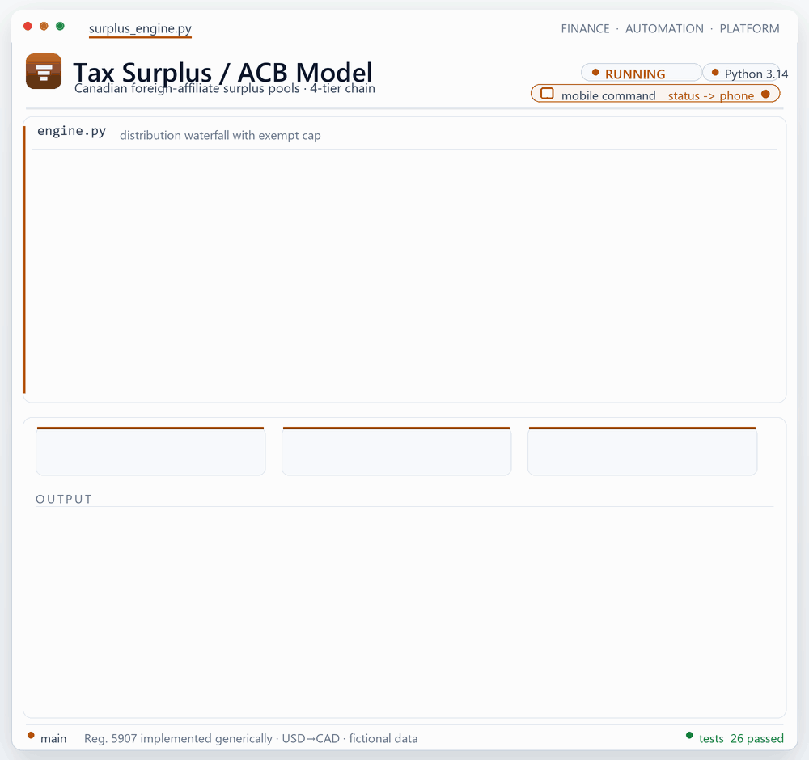

# 🍁 Tax Surplus Engine

<p align="center"></p>
<p align="center"></p>

> A **traceable, reusable calculation engine** for complex international tax —
> AI-assisted, but deterministic at the core — specifically Canadian foreign-affiliate
> **surplus pools & ACB** (adjusted cost base) for CRA Form T1134.

> 🔒 This page describes the platform's **approach and capabilities** and references only **public tax
> law**. It does not reproduce any employer's or client's specific methodology, entities,
> structures, or figures.

---

## The problem it solves
When a Canadian-parented group holds US operating entities in multi-tier ownership chains,
Canadian tax law requires tracking — year by year, entity by entity — how much of each tier's
accumulated earnings is **exempt surplus**, **taxable surplus**, or a return of
**pre-acquisition capital**, plus the **ACB** of each investment. Performed by hand, this work is
exhaustively manual and error-prone.

## Approach
- **A formula-driven engine, not a hand-keyed spreadsheet.** The workbooks are built
  programmatically (Python / openpyxl with headless recalculation) so the math is consistent
  and re-runnable.
- **Traceability as the spine.** A strict source-of-truth hierarchy — *external workpaper →
  cited evidence tab → calculation tab → summary* — so **every figure traces back to a
  source**, and nothing is hardcoded where it should be a formula.
- **Grounded in published rules.** The engine implements the relevant public Canadian Income
  Tax Regulations (the Reg. 5907 series and related provisions) and bridges them with the US
  partnership-tax layer (Form 1065, Schedules K-1/K-2/K-3, §704(c), §263A).
- **Reusable templates.** A canonical workbook is cloned across entities and rolled forward a
  year with a single new column — paired with a documented checklist of the cells that always
  require re-verification after a clone.
- **Knowledge-base packaged.** The methodology is documented so a new preparer can come up to
  speed (including as a queryable NotebookLM source set).

## What this demonstrates
- Turns **sophisticated cross-border tax** into a disciplined, auditable,
  reusable system.
- Is designed around **data lineage and source-of-truth** — the attributes an auditor or tax
  authority cares about.
- Operates across **both the US partnership and Canadian foreign-affiliate frameworks**.

## Tools
`Python (openpyxl)` · `LibreOffice headless recalc` · `Excel` · `construction GL (Excel-GL connector)` · `Bank of Canada FX` · `Claude Code` · `ChatGPT` · `Codex` · `NotebookLM`

## Sample (fictional)
- [Surplus pool calculation](./samples/sample-surplus-calc.md) — a worked example showing the
  evidence → calculation → summary lineage with fully invented entities and numbers.

---

## ▶️ Run it

This repository ships a **fully working** reference implementation of the regime above, over
**fully fictional data**. It models a four-tier chain and, per entity per fiscal year, runs the
full pipeline: standalone income → Reg. 5907(2) adjustment → allocable surplus → distribution
**waterfall** (exempt → taxable → pre-acq capital, with an **exempt-distribution cap**) →
roll-forward of cumulative pools, with **surplus elevating up a tier only on an actual
distribution** and **ACB moving only on capital events**.

```text
Birchwood Op Co (USD)  →  Cedar Mezz Holdings LLC (USD)  →  Maple Fund LP (USD)  →  Demo Holdings Inc. (CAD)
   tier 0, 80% owned        tier 1, 90% owned                tier 2, 100%            tier 3 (top holdco)
```

**Requirements:** Python 3 (3.14 OK), `openpyxl` (already installed), and `pytest` for tests.
No pandas/numpy/faker — stdlib only, seeded `random` for determinism.

```bash
# from this folder:
python -m pip install --quiet pytest        # one-time, for the test suite

# run the full structure for 2021–2024, writing workpapers + summary + Excel:
python -m surplus_engine --start 2021 --end 2024 --out out --xlsx
#   (equivalently: python run.py --start 2021 --end 2024 --out out --xlsx)

# bare run — just print the consolidated summary to the console:
python -m surplus_engine --start 2021 --end 2024

# verify every structural identity ties out (non-zero exit on any break):
python -m surplus_engine --start 2021 --end 2024 --check

# run the rigorous test suite:
python -m pytest -q
```

> 💡 On Windows, if your console can't render the 🔒 banner, set `PYTHONIOENCODING=utf-8`
> (the CLI also degrades gracefully and will not crash on a legacy code page).

### What it produces
- `out/workpaper_<ENTITY>.md` — per-entity workpaper with the **Evidence → Surplus-Details →
  Summary** lineage (one per entity).
- `out/consolidated_summary.md` — multi-entity roll-up, every pool converted to CAD via the
  fictional FX table.
- `out/fx_layer_analysis.md` — single-rate vs **per-layer** ACB in CAD, with the divergence and
  any sign flip (see *Per-layer FX*, below).
- `out/reconciliation_report.md` — independent **tie-out** of every structural identity (see
  *Reconciliation harness*, below).
- `out/surplus_model.xlsx` — the same lineage as an Excel workbook (FX / Evidence /
  Surplus-Details / Summary sheets).

### Example output (real, generated by the command above)

Consolidated summary (excerpt — Cedar Mezz across the run, CAD):

| FY | Entity | Cur | Exempt (CAD) | Taxable (CAD) | Pre-acq (CAD) | ACB (CAD) | Total surplus (CAD) |
|----|--------|-----|-------------:|--------------:|--------------:|----------:|--------------------:|
| 2021 | Cedar Mezz Holdings LLC | USD | 919,847.25 | 643,614.69 | 0.00 | 0.00 | 1,563,461.94 |
| 2022 | Cedar Mezz Holdings LLC | USD | 1,154,535.70 | 841,120.98 | 0.00 | 0.00 | 1,995,656.67 |
| 2023 | Cedar Mezz Holdings LLC | USD | 1,899,908.04 | 1,367,405.78 | 47,513.28 | 47,513.28 | 3,314,827.09 |
| 2024 | Cedar Mezz Holdings LLC | USD | 3,068,965.22 | 2,202,592.74 | 48,173.63 | 0.00 | 5,319,731.59 |

Per-entity workpaper (Cedar Mezz, Surplus-Details layer — note the binding exempt cap ⚑ and
elevation only in distribution years):

| FY | Standalone surplus | + Exempt | + Taxable | Elevated exempt | Elevated taxable | Distribution draws | Exempt cap |
|----|-------------------:|---------:|----------:|----------------:|-----------------:|:-------------------|----------:|
| 2021 | 341,454.75 | 191,009.79 | 150,444.96 | 583,365.13 | 388,910.08 | Exempt 74,871.31, Taxable 49,914.21 | 74,871.31 ⚑ |
| 2022 | 312,678.34 | 169,221.52 | 143,456.82 | 0.00 | 0.00 | — | 0.00 |
| 2023 | 301,007.46 | 167,661.16 | 133,346.30 | 479,373.62 | 319,582.41 | Exempt 96,117.05, Taxable 64,078.04 | 96,117.05 ⚑ |

> The **ACB** line shows the capital-event discipline directly: it rises to 35,502.71 in 2023
> on a capital contribution, then floors to 0 in 2024 on a return of capital — while operating
> income across all four years never moves it.

### Per-layer FX & a reconciliation harness

**Per-layer FX (`fx.py`).** The Summary layer converts a *closing* ACB balance to CAD at one
year's rate. But ACB is built from capital events in different years, and Canadian tax law
translates each event at the rate in effect when it occurred (ITA 261 / Reg. 5907). The `fx.py`
module re-derives ACB in CAD **layer by layer** — each contribution and each applied return of
capital at its own year's rate — and compares it against the single-rate figure. Two properties
make it both trustworthy and revealing:

- **It cannot drift from the engine.** Because an applied return of capital never exceeds basis
  (the excess is a deemed gain), the signed *functional-currency* layers always sum back to the
  engine's closing ACB to the cent — a built-in tie-out (the `FC ties ✓` column).
- **The CAD figure can change sign.** When a contribution and an offsetting return of capital
  fall in years with different rates, the per-layer and single-rate CAD figures diverge. In the
  seeded demo, Cedar Mezz contributes 35,502.71 in 2023 (rate 1.3383) and returns it in full in
  2024 (rate 1.3569): the USD ACB is **0** and the single-rate CAD ACB is **0**, but the
  per-layer CAD ACB is **(660.35)** — a genuine basis difference a blended rate hides.

**Reconciliation harness (`reconcile.py`).** An independent re-derivation of the whole
roll-forward that proves the engine's published numbers tie out. It recomputes each statutory
quantity from the exposed intermediates and checks it against the stored balances; every check
is a named identity with expected, actual, and a signed delta, so a break points straight at the
entity, year, and figure:

> `exempt / taxable / preacq / acb conservation` · `roll-forward continuity` (closing N == opening
> N+1) · `waterfall ≤ distribution` · `exempt draw within cap` · `non-negative balances` ·
> `elevation conservation` (parent lift == Σ children drawn × ownership %) · `ACB↔FX layer tie-out`.

The `--check` flag runs the harness and **fails the process on any break** — a drop-in CI gate:

```text
$ python -m surplus_engine --start 2021 --end 2024 --out out --check
...
Reconciliation: OK (212/212 identity checks pass)
```

### Test output (real)

```text
$ python -m pytest -q
..........................                                               [100%]
28,811 passed
```

The suite asserts the load-bearing rules: **waterfall ordering**, **exempt-cap enforcement**
(binding vs non-binding), **surplus elevates only on distribution** (at the owner's %),
**ACB unaffected by operating income**, **FX applied at the Summary layer**, **roll-forward
continuity** (closing year *N* == opening year *N+1*), **ownership-% allocation**, and a
**deemed gain on negative ACB** (a return of capital beyond basis triggers an ITA 40(3)-style
gain to the owner, with ACB deemed nil rather than negative). The newer suites cover
**per-layer FX** (functional-currency layers tie back to closing ACB; single-rate vs per-layer
divergence; the sign-flip case) and the **reconciliation harness** (every structural identity
ties out on a clean run, and a deliberately tampered balance is detected).

### Layout
```text
tax-surplus-engine/
├── surplus_engine/
│   ├── __init__.py      # package + confidentiality posture
│   ├── model.py         # Entity / YearFacts / PoolBalances / Structure / FxTable
│   ├── engine.py        # the engine: waterfall, elevation, ACB, roll-forward
│   ├── generate.py      # seeded synthetic fictional data
│   ├── report.py        # Markdown workpapers + consolidated summary
│   ├── fx.py            # per-layer (lot-level) FX translation for ACB
│   ├── reconcile.py     # independent reconciliation harness (identity tie-out)
│   ├── workbook.py      # optional openpyxl Excel export
│   ├── cli.py           # argparse CLI (+ --check reconciliation gate)
│   └── __main__.py      # python -m surplus_engine
├── tests/               # pytest suite (28,811 tests)
├── run.py               # convenience entrypoint
├── pytest.ini
└── samples/             # original fictional worked example
```

> 🔒 Everything above — entities, figures, FX rates, paths — is **invented for this portfolio
> demo**. It implements only published Canadian regulations generically and reproduces no real
> entity, person, methodology, or data.
